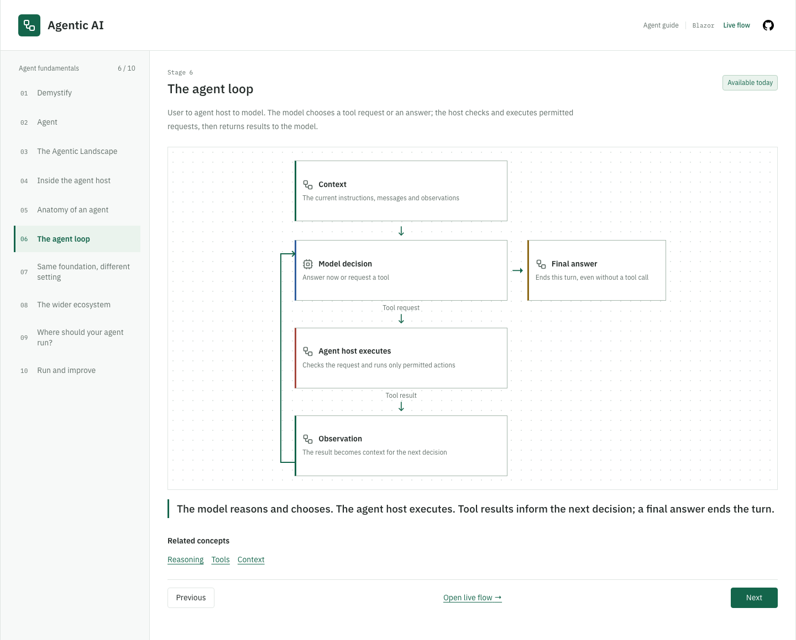
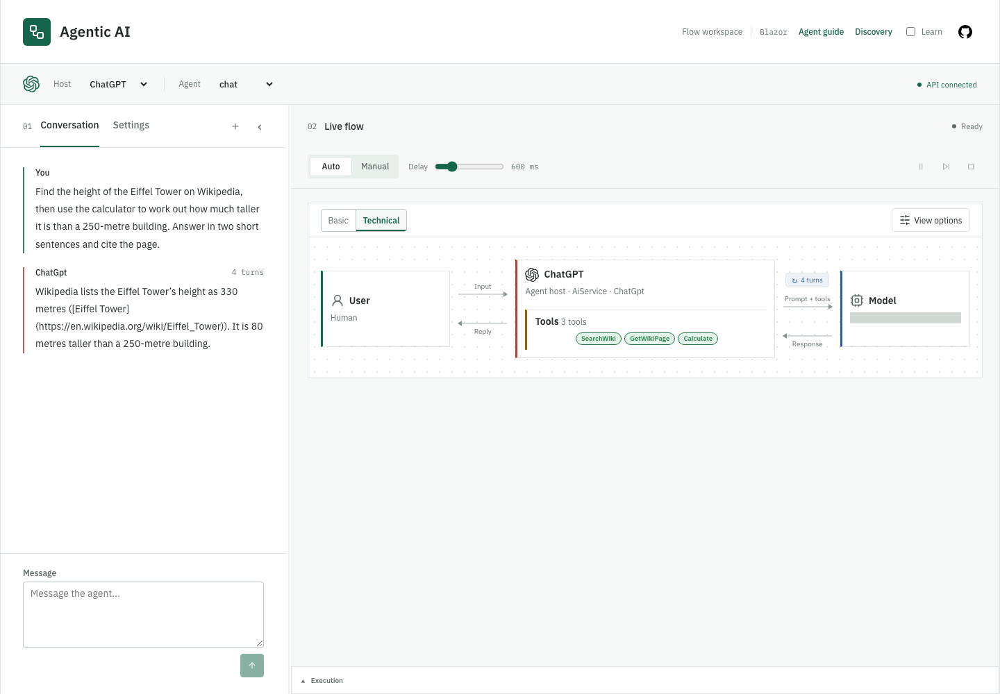

# Agentic Lab

Agentic Lab was created to **demystify agentic AI and show how it works**.
It brings together two complementary parts:

1. **[Learn how agentic AI works](#1-learn-how-agentic-ai-works).** Guided lessons and simple
   explanations introduce agents, models, tools and context.
2. **[See it happen in Live Flow](#2-see-it-happen-in-live-flow).** Run an agent and watch the steps
   between your question and its answer: what the model receives, which tools it asks to use,
   and what comes back.

> [!WARNING]
> This is an educational sample, not a production-ready agent platform. Use a trusted local
> development environment. Before shared or public deployment, add authentication, authorization,
> sandboxing, network/tool policy, resource limits, and a reviewed data-retention policy.
> Read [SECURITY.md](SECURITY.md) before using real credentials or workspace data.

## Project Status

Agentic Lab is actively evolving. APIs, UI details, and configuration may change between versions.
Security fixes target the latest `main` branch; older releases have no separate support commitment.

## 1. Learn How Agentic AI Works

The **Learn** experience explains the building blocks of an agent through guided lessons on models,
tools and context. Start with the core idea:

**Agent = Agent host + Model.** The model chooses the next step. The agent host is the code around
it that supplies context, manages tools and controls execution.

1. You ask a question.
2. The host sends the model your question, instructions, context and available tools.
3. The model returns an answer or asks to use a tool.
4. The host checks and runs allowed tool calls, then sends the results back to the model.

This loop continues until the model gives a final answer. A request to use a tool is not permission
to run it: the host decides what is allowed.

Explore the guided lessons at `/learn` with the [learning-only setup](#learning-only); no Azure
credentials or live model calls are needed.

[](docs/images/06-guided-learning.png)

The agent loop in the guided Learn experience. [Learning guide](docs/learning.md).

## 2. See It Happen in Live Flow

**Live Flow** is the hands-on workspace where you run an agent and see what is happening as it runs.

- Watch the flow between the agent host, model and tools as your question is processed.
- Inspect the actual model requests, responses, tool calls and results.
- Pause, step through execution and replay a captured run without running it again.

The captured activity shows what the application sends and receives, not the model's private
reasoning. Illustrations of model internals are labelled simulations.

Built with [.NET 10](https://dotnet.microsoft.com/download/dotnet/10.0),
[Aspire](https://aspire.dev/) and Azure OpenAI. Read the [vision](VISION.md) for more on the project's
purpose and direction.

[](docs/images/01-live-workspace.png)

Follow a conversation alongside its agent and tools. [Workspace guide](docs/web-flow-page.md).

Screenshots captured locally on 2026-09-22 from a running Blazor build. The live run uses public
Wikipedia data and real calculator calls. Gray masks cover deployment identifiers. The
ChatGPT-labelled host is a representative demo backed by Azure OpenAI, not a connection to the
ChatGPT product. Select an image to open it at full size.

## Security, Data, and Costs

AiService, the React BFF, and the sample MCP/A2A services do not provide caller authentication or
per-user authorization. Chat endpoints can invoke tools; control and workspace endpoints also need
protection. The terminal allowlist and workspace working directory are **not a sandbox**: processes
run with the service account's permissions and can access files and networks outside that directory.
Use only trusted workspaces and integrations. See the [security policy](SECURITY.md) for the full
trust boundaries and private vulnerability-reporting channel.

- Live runs send prompts, conversation history, enabled instructions, selected context, and tool
   results to the configured model service. Azure charges may apply; local startup does not mean
   data stays local. Wikipedia, web-fetch, MCP, and A2A integrations can contact other services.
- Flow captures include model/tool payloads and can contain private data. Backend conversation
   history and frontend captures have separate lifetimes. Reset does not erase external copies,
   exported logs, screenshots, browser workspace preferences, or tool side effects. See
   [conversation memory](docs/agents.md), [Blazor replay retention](docs/execution-explorer.md#replay-retention),
   and [React state](docs/react-frontend.md#transport-and-state).
- OpenTelemetry collects logs, traces, and metrics for the configured collector. Review their
   contents, access, and retention before using sensitive data; aggregate metrics without content
   do not guarantee that every log or trace is free of sensitive information.

To explore without model or protocol calls, use the [learning-only Web guide](#learning-only)
without starting AppHost or the model/protocol services. Disabling an example or individual tools
does not turn live chat into an offline workflow or impose a cost limit.

## Prerequisites

For the full local application:

- [.NET 10 SDK](https://dotnet.microsoft.com/download/dotnet/10.0).
- [Aspire CLI](https://aspire.dev/get-started/install-cli/) matching the pinned **13.5.4** version.
  The AppHost restores its Aspire SDK automatically and uses the SDK-paired CLI through `dnx`
  as a fallback when a compatible CLI is not on `PATH`.
- An [Azure OpenAI](https://learn.microsoft.com/azure/ai-services/openai/) resource with a deployed
  chat model that supports tool calling, its endpoint, deployment name, and API key.
- Git to clone the repository, or download and extract its source archive.

Node.js **24 LTS** is needed only for the optional React frontend. Docker is not required for
the default local setup. The [learning-only option](#learning-only) needs just the .NET SDK
and the source code, without Azure credentials or Aspire orchestration.

## Run Locally

### Get the Source

```sh
git clone https://github.com/o-viken/agenticlab.git
cd agenticlab
```

Run the following commands from the repository root.

### Configure Azure OpenAI

Store your settings in the AppHost's local user-secrets store:

```sh
dotnet user-secrets set "AzureOpenAI:Endpoint" "<your-azure-openai-endpoint>" --project src/AgenticLab.AppHost
dotnet user-secrets set "AzureOpenAI:Deployment" "<your-deployment-name>" --project src/AgenticLab.AppHost
dotnet user-secrets set "AzureOpenAI:ApiKey" "<your-api-key>" --project src/AgenticLab.AppHost
```

Use the **deployment name** you created in Azure, not just the model's name. Aspire passes these
settings to the services that call the model. Never commit credentials. Live runs use your Azure
resource and may incur charges; prompts and selected context are sent to the configured model service.

### Build and Start

Using the .NET CLI:

```sh
dotnet build AgenticLab.slnx
dotnet run --project src/AgenticLab.AppHost
```

Alternatively, use the Aspire CLI from the repository root:

```sh
aspire run
```

Aspire finds the AppHost through [aspire.config.json](aspire.config.json), restores and builds
it and its dependencies, then starts the application. No separate build command is needed to run it.

Open the Aspire dashboard URL printed in the terminal, then open the **web** resource's endpoint.
The dashboard also provides service logs and traces.

Development startup enables **Default**, **ChatGPT**, **GitHub Copilot** and **Copilot 365**.
Start with a conversation in Default, or select **ChatGPT / chat** and try:

> Find the height of the Eiffel Tower on Wikipedia, then calculate how much taller it is
> than a 250-metre building.

Watch the model and tool activity, inspect the captured data, or use Manual mode to advance one
step at a time. The vendor-labelled experiences are representative demos backed by your Azure
OpenAI deployment, not connections to those vendors' products.

### Learning Only

To explore the guided lessons without configuring Azure OpenAI, run only the Web project:

```sh
dotnet run --project src/AgenticLab.Web
```

Open the listening URL printed in the terminal and visit `/learn`. The guide works without
the AI service; live chat requires the full setup above.

### With the React Frontend

With Node.js **24 LTS** installed and Azure OpenAI configured above, install the frontend
dependencies and start with React enabled:

```sh
npm --prefix src/AgenticLab.React ci
aspire run -- --ReactFrontend:Enabled=true
```

Or use the .NET CLI after installing the same frontend dependencies:

```sh
dotnet run --project src/AgenticLab.AppHost -- --ReactFrontend:Enabled=true
```

Open the **react** resource's endpoint in the Aspire dashboard. The **web** resource still opens
Blazor; React runs alongside it and uses the same AI service through a backend-for-frontend.
See the [React setup guide](docs/react-frontend.md#run-with-aspire) for customization and builds.

### Console Client

The **console** resource does not start automatically. Start it explicitly from Aspire with an
attached terminal for input, or follow the [standalone console instructions](docs/web-flow-page.md#running-the-console).

### Self-Contained Examples

Optional examples are registered as independent projects, keeping their domain code, UI, assets,
tests and documentation together. See the [example catalogue and contributor guide](docs/examples.md)
and the [Windfarm project](src/AgenticLab.Examples.Windfarm/README.md) for an end-to-end process demo,
or [Copilot 365](src/AgenticLab.Examples.Copilot365/README.md) for workplace chat, research and analysis
over synthetic Microsoft 365 data.
Every non-default host is an opt-in example, including **ChatGPT**, **Gemini**, **GitHub Copilot**,
**Claude Code**, **Claude**, **Copilot 365** and **Windfarm**. Each owns its host-specific prompts,
branding and tests. The shared learning guide remains available independently of enabled examples.
Use `Examples:<id>:Enabled=true` with IDs `chatgpt`, `gemini`, `copilot`, `claude-code`, `claude`,
`copilot365` or `windfarm`; flags can be combined. AppHost's Development settings enable `chatgpt`,
`copilot` and `copilot365`; use `--Examples:<id>:Enabled=false` to disable one. Other environments
start with only Default unless examples are explicitly enabled.

For example, enable the workplace Copilot host and its three agents:

```sh
dotnet run --project src/AgenticLab.AppHost -- --Examples:copilot365:Enabled=true
```

## Documentation

| Guide | What You Will Find |
|-------|--------------------|
| [Agents and API](docs/agents.md) | Agent personas, chat API, conversation memory, prompts, and model configuration. |
| [Web Flow Workspace](docs/web-flow-page.md) | Live visualization, panels, captured context, and execution controls. |
| [Blazor Design System](docs/design-system.md) | Shared tokens, components, local fonts, accessibility, and the development catalogue. |
| [Execution Explorer](docs/execution-explorer.md) | Replay, breakpoints, streaming/control API, and retention limits. |
| [Learning](docs/learning.md) | Guided lessons and the contextual Learn panel. |
| [Workspace Features](docs/workspace.md) | Workspace agents, skills, custom instructions, and file/terminal tools. |
| [Protocols](docs/protocols.md) | MCP tools, A2A agents, discovery, and protocol integration tests. |
| [React Frontend](docs/react-frontend.md) | Optional frontend setup, customization, builds, and browser tests. |
| [Example Modules](docs/examples.md) | Self-contained community examples, extension contracts and registration. |
| [Architecture and Conventions](AGENTS.md) | Project structure and implementation guidance for contributors. |
| [Browser Checks](tools/README.md) | Responsive UI smoke checks and separate browser load-test setup. |
| [Security Policy](SECURITY.md) | Private vulnerability reporting, tool risks, credentials, and data boundaries. |
| [Contributing](CONTRIBUTING.md) | Development workflow, checks, pull requests, and maintainer publication gates. |

## Contributing

Contributions can improve code, tests, documentation, lessons, or examples. Read
[CONTRIBUTING.md](CONTRIBUTING.md) for setup, credential-free .NET tests, React/browser checks,
and pull-request expectations. Discuss substantial changes in an issue first and keep changes focused.

Never include credentials, private workspace content, or sensitive captures in issues or pull requests.
Report suspected vulnerabilities privately through the [security policy](SECURITY.md).

## License

Originally conceived and created by [o-viken](https://github.com/o-viken). Code and documentation
are licensed under the [Apache License 2.0](LICENSE), except where otherwise noted.
See [NOTICE](NOTICE) for project attribution. Third-party assets retain their own licenses,
including the [Web icons](src/AgenticLab.Web/wwwroot/icons/lucide/LICENSE) and
[React assets](src/AgenticLab.React/public/licenses/). Published container images include the
project license and attribution at `/app/LICENSE` and `/app/NOTICE`.