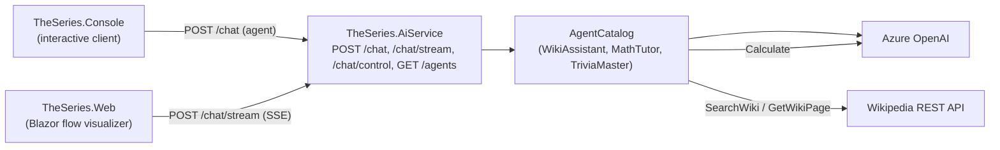

# TheSeries

A [.NET Aspire](https://learn.microsoft.com/dotnet/aspire/) sample built on **.NET 10**: a set of AI agents backed by Azure OpenAI, each with its own persona and toolset, that answer questions using Wikipedia and a calculator as tools.

## How it works



The Console sends a question (and the chosen agent) to the AI service's `POST /chat` endpoint. The service
hosts an `AgentCatalog` of stateless `ChatClientAgent`s (Azure OpenAI), each composed from an
`IAgentDefinition` that declares its instructions and tool subset. `GET /agents` lists the available
agents. The Blazor web UI calls `POST /chat/stream`, which streams the real execution steps (LLM
round-trips and tool calls) as Server-Sent Events so the data flow can be animated live.

### Corporate workbench

The Web app's **Default** vendor uses the [Corporate Workbench design](design/mockups/v8-corporate-workbench.html):
off-white surfaces, forest-green actions, a serif product heading and flat, divider-led panels.
Flow and Discovery share this visual treatment. Brand vendors retain their own palettes and agent behavior;
select **Default** in the vendor rail to see the green theme. Existing vendor preferences are preserved.

The Controls and Learn panels start at 276 and 260 pixels wide; saved panel sizes still take precedence.
Below 1200 pixels the workbench stacks into a scrolling page. The diagram also stacks when its own pane
is 620 pixels wide or narrower, including after panel resizing. Contributor colors retain their meanings,
and reduced-motion preferences disable visual animations without changing execution pacing.
The main diagram uses locally bundled [Lucide icons and license](src/TheSeries.Web/wwwroot/icons/lucide/LICENSE),
with no runtime CDN dependency.

### Agents

| Agent | Persona | Tools |
|-------|---------|-------|
| **ChatBot** (default) | Friendly conversational companion that chats from its own knowledge. | _(none)_ |
| **WikiAssistant** | Concise research helper grounded in Wikipedia. | `SearchWiki`, `GetWikiPage` |
| **MathTutor** | Patient tutor that solves and explains arithmetic. | `Calculate` |
| **TriviaMaster** | Playful trivia host that researches facts and crunches numbers. | `SearchWiki`, `GetWikiPage`, `Calculate` |

## Projects

The solution ([TheSeries.slnx](TheSeries.slnx)) contains five projects, orchestrated by Aspire:

| Project | Role |
|---------|------|
| [src/TheSeries.AppHost](src/TheSeries.AppHost/AppHost.cs) | Aspire orchestrator. Wires up resources, injects Azure OpenAI config, sets service references. |
| [src/TheSeries.AiService](src/TheSeries.AiService/Program.cs) | ASP.NET Core minimal-API service exposing `POST /chat`, `POST /chat/stream`, `POST /chat/control` and `GET /agents`. Hosts the agent catalog. |
| [src/TheSeries.Console](src/TheSeries.Console/Program.cs) | Interactive console client that calls the AI service via service discovery. |
| [src/TheSeries.Web](src/TheSeries.Web/Program.cs) | Blazor Server app that animates the live data flow (User → Client → Harness → Tools → LLM) from the `/chat/stream` events. |
| [src/TheSeries.ServiceDefaults](src/TheSeries.ServiceDefaults/Extensions.cs) | Shared OpenTelemetry, health checks, resilience, and service discovery. |

## Prerequisites

- [.NET 10 SDK](https://dotnet.microsoft.com/download)
- An [Azure OpenAI](https://learn.microsoft.com/azure/ai-services/openai/) resource with a deployed chat model

## Configuration

Azure OpenAI settings are read from the **AppHost user-secrets** and injected into the AI service as
environment variables. Set them on the AppHost project:

```sh
dotnet user-secrets set "AzureOpenAI:Endpoint" "<url>" --project src/TheSeries.AppHost
dotnet user-secrets set "AzureOpenAI:Deployment" "<deployment>" --project src/TheSeries.AppHost
dotnet user-secrets set "AzureOpenAI:ApiKey" "<key>" --project src/TheSeries.AppHost
```

Missing configuration throws at agent creation. **Never commit secrets.**

## Build and run

Build the solution:

```sh
dotnet build TheSeries.slnx
```

Run everything (launches the Aspire dashboard):

```sh
dotnet run --project src/TheSeries.AppHost
```

### Running the Console

The Console is registered with `WithExplicitStart()`, so it does not launch automatically with the rest
of the app. To run it:

1. Start the app with `dotnet run --project src/TheSeries.AppHost` and open the Aspire dashboard.
2. Find the `console` resource and start it (▶). It needs an attached terminal for stdin, so use the
   dashboard's terminal/console view to interact with it.
3. The console lists the available agents and starts on the default. Type a question at the
   `<agent>>` prompt and press Enter. Use `/agents` to list them again and `/agent <name>` to switch
   (e.g. `/agent MathTutor`). Press Enter on an empty line to quit.

To run the Console **standalone** (against an already-running AI service), pass the service URL:

```sh
dotnet run --project src/TheSeries.Console -- --AiService:Url https://localhost:7123
```

Under Aspire it resolves the AI service by name (`https+http://aiservice`) via service discovery, so no
URL is needed.

### Running the web UI

The `web` resource (Blazor Server) starts automatically with the app and is exposed on an external HTTP
endpoint. Open it from the Aspire dashboard's `web` resource link. Type a message, pick an agent, then
watch the data flow light up node-by-node as the agent runs. The stepping is **gated on the backend**, so
the animation stays in sync with the real agent execution (and its OpenTelemetry spans) rather than being
a client-side replay. Two modes control the pacing:

- **Auto** — the AI service advances on its own, pausing for an adjustable *step delay* after each real
  step. The delay can be changed live, and the run can be paused/resumed at any time.
- **Manual** — the AI service blocks before each step until you click *Next*, so the next LLM round-trip
  or tool call does not start until you allow it.

The UI sends `next`, `pause`, `resume` and `stop` actions to `/chat/control`. The final answer appears
once the run completes.

**Breakpoints** in Settings pause actual execution even in Auto mode: **Before model request**,
**After model response**, **Before tool execution**, and **After tool result**. Model breakpoints
apply to every complete round-trip, including responses that request tools, not individual tokens.
Tool breakpoints apply to each local or MCP function call, including the local A2A delegation call
(not the remote agent's internal steps). The paused reason and tool name appear in both Settings
and Chat. **Continue** runs in Auto until the next selected breakpoint; **Next** switches to Manual
and releases the current boundary; **Stop** cancels. Breakpoints start off, remain selected across
conversations, and clear on page refresh. Changing selections during a run affects future boundaries
but does not release an existing pause. After-tool breakpoints follow successful tool returns;
thrown errors retain the existing error behavior. Completed side effects cannot be undone.

### `GET /agents`

Lists the available agents and the default name:

```json
{
  "agents": [
    { "name": "ChatBot", "description": "Friendly conversational chatbot that chats from its own knowledge, with no tools." },
    { "name": "WikiAssistant", "description": "Concise research helper that answers factual questions using Wikipedia." },
    { "name": "MathTutor", "description": "Patient tutor that solves and explains arithmetic step by step." },
    { "name": "TriviaMaster", "description": "Playful trivia host that researches facts and crunches numbers." }
  ],
  "default": "ChatBot"
}
```

### `POST /chat`

Request (`agent` is optional; defaults to `ChatBot`):

```json
{ "message": "Who was Alan Turing?", "agent": "WikiAssistant" }
```

Response (echoes which agent answered):

```json
{ "reply": "Alan Turing was a British mathematician and computer scientist...", "agent": "WikiAssistant" }
```

Returns `400 Bad Request` when `message` is empty or `agent` is an unknown name.

### `POST /chat/stream`

Same request shape as `/chat` plus a `sessionId` (correlates control calls), a `manual` flag, and an
optional `stepDelayMs` (server-side delay between steps in Auto mode). An optional `breakpoints` array
accepts `before-model`, `after-model`, `before-tool`, and `after-tool`; omitted or empty means none.
Unknown breakpoint names return `400 Bad Request`. Returns a
`text/event-stream` of `flow` events describing the run as it happens — each event has a `sequence`,
`kind` (`received`, `llm-request`, `tool-call`, `tool-result`, `llm-response`, `final`, `error`, `breakpoint`),
`label`, an optional `detail`, the `turn` (1-based LLM round-trip it belongs to), and an optional
`data` payload with the full, untruncated request/response for that step. The stream is gated on the
backend: each real step waits for the session to be allowed to advance, so it stays in sync with the
agent's execution and telemetry. The Blazor web UI consumes this to animate the data flow — with
separate send/receive arrows, a loop/turn counter, and expandable steps that reveal the real data
sent to and returned by the model.

`breakpoint` events bypass normal pacing so the browser learns about a pause while execution is
blocked inside a model or tool call. Their `data` is JSON containing `Id`, `Kind`, `Tool`, `Paused`
and `Manual`. They are control notifications, not conversation content, and are excluded from the
steps list, prompt signature and context totals.

### `POST /chat/control`

Drives an in-progress `/chat/stream` run, keyed by its `sessionId`:

```json
{ "sessionId": "abc123", "action": "next", "manual": true, "delayMs": 600 }
```

`action` is one of `next` (advance one step in Manual mode), `pause`, `resume`, or `stop`. `manual` and
`delayMs` are optional live adjustments. Returns `204 No Content`, or `404 Not Found` when the session is
unknown (e.g. already finished).

Send `breakpoints` to replace the enabled selection live (`[]` clears it; omission leaves it unchanged).
To release a breakpoint, include its current notification's `Id` as `breakpointId`:

```json
{ "sessionId": "abc123", "action": "resume", "breakpointId": "pause-occurrence-id" }
```

`resume` selects Auto; `next` selects Manual. A stale or already-released ID returns `409 Conflict`.
Ordinary pacing controls cannot bypass the breakpoint latch. Discovery and non-streaming `/chat`
do not use execution breakpoints.

### Breakpoint Tests

`dotnet test tests/TheSeries.AiService.Tests/TheSeries.AiService.Tests.csproj` runs deterministic
model/tool pipeline tests without Azure credentials. The tests check execution ordering, successive
tool calls, cancellation, stale controls, live selection changes, manual/auto pacing and early user answers.

## Conventions

- Target framework `net10.0`; `Nullable` and `ImplicitUsings` enabled across all projects.
- Top-level statements in `Program.cs` and minimal APIs (no controllers).
- DTOs are `internal sealed record` types declared at the bottom of the file that uses them.
- Agent capabilities are plain methods annotated with `[Description]` (on the method and each parameter)
  and exposed via `AIFunctionFactory.Create(...)` in each tool's `AsTools()`.
- Each agent is an `IAgentDefinition` under `src/TheSeries.AiService/Agents/`; add a new one by
  implementing the interface and registering it in `Program.cs`.
- Services reach each other by Aspire resource name (e.g. `https+http://aiservice`) through service
  discovery, not hardcoded URLs.

See [AGENTS.md](AGENTS.md) for contributor and AI-agent guidance.
