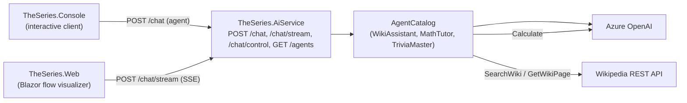

# TheSeries

A [.NET Aspire](https://learn.microsoft.com/dotnet/aspire/) sample built on **.NET 10**: a set of AI agents backed by Azure OpenAI, each with its own persona and toolset, that answer questions using Wikipedia and a calculator as tools.

## How it works



The Console sends a question (and the chosen agent) to the AI service's `POST /chat` endpoint. The service
hosts an `AgentCatalog` of stateless `ChatClientAgent`s (Azure OpenAI), each composed from an
`IAgentDefinition` that declares its instructions and tool subset. `GET /agents` lists the available
agents. The Blazor web UI calls `POST /chat/stream`, which streams the real execution steps (LLM
round-trips and tool calls) as Server-Sent Events so the data flow can be animated live.

### Corporate workbench

Every harness in the Web app uses the [Corporate Workbench design](design/mockups/v8-corporate-workbench.html):
off-white surfaces, forest-green actions, a serif product heading and flat, divider-led panels.
Flow and Discovery share this visual treatment. Vendor logos distinguish harnesses without changing colors.
Harness prompts, agent choices and saved vendor preferences are preserved.

Prompt signature, Inference, Embeddings and Neural network use the same flat sections,
compact headers and controls. Their role colors, signed red/blue vectors and token linking
are preserved. Narrow panes reflow the signature bars; reduced motion reveals answer tokens
without animation and suppresses the network's visual effects without changing playback controls.
Inference, embeddings and the network remain simulations, not captured model internals.

The Conversation composer places the **Agent** selector below the message box, above the send controls.
The message box, workspace path and repo base folders fields indicate focus with a subtle background tint, without an extra outline.

Flow, Agent guide and Discovery use an **Agentic AI** heading with the subtitle underneath and
plain navigation links. The Flow header stays neutral across vendor selections and spans the full
window. All three headers use 12-pixel vertical padding, with 24-pixel horizontal gutters on desktop
and 16-pixel gutters below 1200 pixels. The harness/vendor rail begins below the Flow header,
beside the workspace on desktop and as a horizontal
strip above the panels below 1200 pixels.

The live Flow diagram follows the Agent guide's visual language: a subtle 24-pixel grid, square nodes
with compact left-aligned icons and colored edges, plain dashed boundaries, and divider-led tool
sections. The Agent boundary explicitly labels **Agent = Agent host + Model**. Active nodes pulse
without moving or resizing; directional arrows retain their live animations and align vertically
when the diagram stacks. Perspectives, breakpoints and panel persistence are unchanged.

The Controls and Learn panels start at 276 and 260 pixels wide; saved panel sizes still take precedence.
Below 1200 pixels the workbench stacks into a scrolling page. The diagram also stacks when its own pane
is 620 pixels wide or narrower, including after panel resizing. Contributor colors retain their meanings,
and reduced-motion preferences disable visual animations without changing execution pacing.
The main diagram uses locally bundled [Lucide icons and license](src/TheSeries.Web/wwwroot/icons/lucide/LICENSE),
with no runtime CDN dependency.

### Remote A2A agents

Select **Orchestrator** and **Expert** to see each discovered remote agent (Research and Poet by
default) as its own **Agent host + Model** composition below the main flow. Both agent hosts run in the same
separate **A2A service** process; the cloud-model nodes show each agent's model role, not separate
deployments. **Agent** outlines each composition, while **Environment & risk** distinguishes the
shared server process from the cloud models. Narrow panes stack each harness above its model.
The remote area has a grid-free background, with alternating blue/green bands grouping each agent's
harness and model. This visual separation remains visible when boundary overlays are off.

Request/result arrows highlight the targeted agent. The display distinguishes **Delegation requested**
from **Result returned**: the former is a captured tool request, not confirmation of a network send,
and a result can contain an error. Remote model calls, prompts and token counts are **not captured**;
internal model links stay static. Generic model labels do not borrow the Orchestrator's deployment.

Execution playback uses the roster saved with that exchange and pairs calls/results by call ID.
Selecting a request never reveals its future reply. Missing structured metadata or unknown targets
fall back to the generic resource display. Replay and held/stopped runs do not animate remote links.

### Agent guide

Open **Agent guide** from Flow or Discovery for the standalone `/learn` page. The link opens a new
tab so a live or paused run remains in its original page. The existing **Learn** checkbox still
controls the contextual topic panel; it is independent of the guide.

The guide fits the viewport: the header and stage navigation stay visible while the lesson pane
scrolls independently. Navigation scrolls separately when needed and becomes a horizontal strip
on narrow screens. Reveal controls stay pinned at the top of the pane while scrolling their lesson.

Ten stages connect the ideas: **Demystify**, **Agent**, **The Agentic Landscape**, **Inside the agent host**,
**Anatomy of an agent**, **The agent loop**, **Same foundation, different setting**, **The wider ecosystem**, **Where should your agent run?**, and
**Run and improve**. The short **Demystify** introduction demystifies agents: why understanding
them matters, what they are, and how a task moves through the system. It is the default opening at
`/learn` and retains the `why-agents` permalink. Each subsequent stage has a concept diagram,
and all stages link to related topics from the same concept catalog as the contextual panel.
The introduction shows **Why**, **What**, then **How**, one at a time, with Previous/Next step
controls, a counter and Restart. Returning to the stage starts at Why.
**The Agentic Landscape** connects chat, coding, office and custom purposes to one shared
agentic foundation. These overlapping examples are not a vendor taxonomy.
It has two reveals: the agent purposes, then their shared **Agent host + Model** foundation.
Execution is introduced later in the dedicated **The agent loop** chapter.
**Agent** builds **Agent host + Model** in seven reveals: a names-only Agent host + Model
overview, host details and responsibilities, host tool execution, model details,
the outbound context/tool definitions/tool results, the model's answer or tool
request, and the enclosing agent boundary. The agent host manages context, instructions, tools,
memory and execution controls; the model reasons, plans and chooses a next step or final answer.
**The model reasons. The agent host acts. Together, they form an agent.** A model request is not
permission to execute. Harness remains the technical term for the host's agent-running machinery;
host describes a software role, not a machine. Triggers remain outside the agent boundary.
Its original `/learn?stage=model-to-agent` permalink is preserved.
Both component boxes and the plus sign remain visible from the opening overview; descriptions,
responsibilities, tools and exchange paths appear progressively without moving the boxes.
These two lessons, **Anatomy of an agent**, and **Same foundation, different setting** provide Previous/Next reveal controls,
**Show complete diagram** and **Restart**, separate from chapter navigation. Reveals reserve
their layout space, are manually advanced (no autoplay), and respect reduced motion.
Reveal progress resets on a chapter change or reload; opening a related concept does not reset it.
**Inside the agent host** uses the overview's five responsibilities in the same order: **Gather context**,
**Load instructions**, **Make tools available**, **Manage memory**, and **Enforce execution controls**.
Its `inside-the-harness` permalink remains unchanged.
**Anatomy of an agent** (`/learn?stage=anatomy-of-agent`) follows with eight cumulative reveals:
system prompt, available host capabilities, agent persona, selected tools and model/settings,
task prompt, custom instructions, skill descriptions, and a loaded skill body. The layered diagram
distinguishes standing guidance, configured capabilities, and per-task context. MCP tools and A2A
delegation are labelled separately; a skill is guidance loaded through an allowed tool, not extra permissions.
The **Chat / Office / Coding / Custom** selector changes the entire anatomy to fit its purpose:
system guidance, capability catalogue and selected subset, persona, model role, required controls,
task, custom instructions and playbooks. **Office** is a Microsoft 365 Copilot-style example with
mail, calendar, document and people connectors plus sending mail with user confirmation.
Its **Meeting assistant / Document reviewer** selector contrasts briefing and confirmed communications
with read-only document comparison. The reviewer has its own task, model-choice rationale and
playbooks; only document search and skill reading are selected, with no sending, editing or deletion.
**Chat** researches questions; **Custom** investigates equipment alerts with read-only telemetry
and manuals, without equipment control. These are illustrative teaching configurations, not product
replicas or claims about native connectors, skills, models or enforcement in Microsoft 365.
**Coding** offers **Ask / Plan / Implement / Review**. Ask, Plan and Review stay read-only;
Implement selects workspace writes and terminal use with approval or allowlisting, resource limits
and no production access. Its task and playbooks demonstrate an edit-and-test workflow.
Every persona across Chat, Office, Coding and Custom carries a **Model choice example** and a short
rationale: conversational speed, long-context synthesis, planning/review reasoning, reliable coding
tool use or domain-tested alert triage. These are capability-based trade-offs, not required model
products or automatic routing. Model choice never grants permissions. The host prompt and capability
catalogue remain shared within each purpose. Purpose and mode changes preserve reveal progress; choosing a purpose
selects its first mode. **Restart** retains the selected purpose and mode; leaving and reentering the
chapter or reloading restores Coding / Ask.
Opening a related topic preserves both selection and progress. No backend agent is selected and no
model, tool or discovery call runs. On narrow screens the layers stack in reveal order.
**The agent loop** shows the model's decision, the
tool execution and observation cycle, and a separate final-answer exit that can bypass tools.
**Same foundation, different setting** compares illustrative local/cloud application configurations
and names familiar applications by purpose: ChatGPT, Gemini and Claude for Chat; GitHub Copilot,
Claude Code and Gemini Code Assist for Coding; Microsoft 365 Copilot and Gemini for Google Workspace
for Office; and an in-house agent or business application for Custom. Products can span purposes,
and agentic capabilities depend on mode/configuration. These examples do not claim that the
local/cloud comparisons describe those products. The configurations show the shared foundation
for each purpose, including context, tools and controls. A separate user/schedule/event selector
explains triggers. A local application can use a remote model; portability and tool access are
not automatic. These controls never move agents, schedule work or make model calls.
**Where should your agent run?** (`/learn?stage=where-to-run`) compares **Personal runtime**,
**Existing product**, **Your own service**, and **Managed agent platform** using one report-review task.
Each option separates agent host, model service, tools/data access and operational ownership,
then explains its trade-off and the approvals or capabilities needed to use it. These are operating
models, not a list of platforms available in your organization.
The **Vendors and stacks** list adds expandable, officially sourced examples for the selected
category: Microsoft Agent Framework, OpenAI Agents SDK, Claude Agent SDK, Google ADK, Strands
Agents and LangGraph for code-based stacks; Microsoft 365 Copilot, Copilot Studio, ChatGPT GPTs
and workspace agents, Gemini Gems and n8n Cloud for product-based work; Foundry Agent Service,
Google's Gemini Enterprise Agent Platform Agent Runtime, Amazon Bedrock AgentCore Runtime,
Claude Managed Agents and LangSmith Deployment for managed operation. Self-hosted n8n appears
under personal/own-service options; LangSmith Deployment spans own-service and managed options.
Each entry distinguishes its offering type from hosting and links to an official source. Sources
were checked on 17 September 2026; preview/beta, license and access caveats are not guarantees of
organizational availability. Category changes collapse the new list's details, without resetting
the lesson's reveal, trigger or readiness selections.
Three manual reveals cover the comparison, triggers/supervision and hybrid connections, then
operational readiness. Later sections remain hidden and unfocusable until revealed. User request,
schedule and event are independent of hosting; all retain review before publication in this example.
**Try it yourself / Share with a team / Run operationally** compares identity, state and isolation,
recovery, cost and release controls. Local-to-cloud is one possible path, not a requirement or a
promise of portability. Selections preserve reveal progress; Restart preserves selections, while
chapter reentry or reload resets them. Related topics do not reset state. No deployment, platform
discovery, scheduling or backend calls are performed by this lesson.
**The wider ecosystem** contrasts MCP tool calls with A2A delegation, without exposing agent internals.
**Run and improve** follows Run, Observe, Evaluate and Improve back to the next tested version;
this operating cycle is separate from the agent's per-turn execution loop.
Stage URLs such as `/learn?stage=agent-loop` support bookmarks, reload and browser Back/Forward.
The product-specific **Map to Microsoft Foundry** stage is retained in code but hidden from the guide.
Previous/Next skip it, and **Run and improve** is stage 08. Hidden or unknown stage IDs fall back
to the first stage. Live-flow links navigate only; they never send a prompt.
Discovery is available from the live Flow header, not from the guide. It opens as a modal overlay
that keeps the conversation, draft and execution history intact. Close, Escape or a backdrop click
returns to the same conversation. Opening only reads the discovery snapshot; re-discovery is explicit
and unavailable while the current chat runs. The standalone `/discovery` URL remains available.

The diagrams are explanations, not live telemetry. Landscape and environment comparisons are
illustrative, not product or deployment guarantees. The final stage distinguishes today's execution traces from future
Foundry hosting and managed-evaluation integration. The guide works without AiService or Azure
credentials; run only the Web project and visit `/learn`:

```sh
dotnet run --project src/TheSeries.Web
```

Focused tests validate stable stage URLs, navigation, reveal bounds/reset, independent example/trigger
selection, per-stage node selection and references to the shipped concept content:

```sh
dotnet test tests/TheSeries.Web.Tests/TheSeries.Web.Tests.csproj
```

### Agents

| Agent | Persona | Tools |
|-------|---------|-------|
| **ChatAgent** (default) | Friendly conversational companion that chats from its own knowledge. | _(none)_ |
| **ChatGpt** | ChatGPT demo's conversational assistant with Wikipedia lookup and arithmetic. | `SearchWiki`, `GetWikiPage`, `Calculate` |
| **WikiAssistant** | Concise research helper grounded in Wikipedia. | `SearchWiki`, `GetWikiPage` |
| **MathTutor** | Patient tutor that solves and explains arithmetic. | `Calculate` |
| **TriviaMaster** | Playful trivia host that researches facts and crunches numbers. | `SearchWiki`, `GetWikiPage`, `Calculate` |

Select **ChatGPT / chat** for a tool-using conversation with no additional API keys or services.
Try: "Find the height of the Eiffel Tower on Wikipedia, then calculate how much taller it is
than a 250-metre building." Wikipedia lookup is not general web search or a live results feed.
See [the ChatGPT demo](docs/agents.md#chatgpt-lookup-and-calculation-demo) for details.

## Projects

The solution ([TheSeries.slnx](TheSeries.slnx)) contains five projects, orchestrated by Aspire:

| Project | Role |
|---------|------|
| [src/TheSeries.AppHost](src/TheSeries.AppHost/AppHost.cs) | Aspire orchestrator. Wires up resources, injects Azure OpenAI config, sets service references. |
| [src/TheSeries.AiService](src/TheSeries.AiService/Program.cs) | ASP.NET Core minimal-API service exposing `POST /chat`, `POST /chat/stream`, `POST /chat/control` and `GET /agents`. Hosts the agent catalog. |
| [src/TheSeries.Console](src/TheSeries.Console/Program.cs) | Interactive console client that calls the AI service via service discovery. |
| [src/TheSeries.Web](src/TheSeries.Web/Program.cs) | Blazor Server app that animates the live data flow (User → Client → Harness → Tools → LLM) from the `/chat/stream` events. |
| [src/TheSeries.ServiceDefaults](src/TheSeries.ServiceDefaults/Extensions.cs) | Shared OpenTelemetry, health checks, resilience, and service discovery. |

## Prerequisites

- [.NET 10 SDK](https://dotnet.microsoft.com/download)
- An [Azure OpenAI](https://learn.microsoft.com/azure/ai-services/openai/) resource with a deployed chat model

The AppHost pins Aspire **13.5.4**; `dotnet restore` downloads the matching SDK automatically.
CLI bundle integration is enabled (`AspireUseCliBundle=true`). Install the matching
[Aspire CLI](https://aspire.dev/get-started/install-cli/) for local development. The SDK uses a
compatible CLI on `PATH`, with its SDK-paired CLI package through `dnx` as a fallback.

## Configuration

Azure OpenAI settings are read from the **AppHost user-secrets** and injected into the AI service as
environment variables. Set them on the AppHost project:

```sh
dotnet user-secrets set "AzureOpenAI:Endpoint" "<url>" --project src/TheSeries.AppHost
dotnet user-secrets set "AzureOpenAI:Deployment" "<deployment>" --project src/TheSeries.AppHost
dotnet user-secrets set "AzureOpenAI:ApiKey" "<key>" --project src/TheSeries.AppHost
```

Missing configuration throws at agent creation. **Never commit secrets.**

Conversation history is held in memory by the AI service and expires on a sliding inactivity window.
The defaults retain an active conversation for one hour and scan for expired entries every five minutes;
override them in `src/TheSeries.AiService/appsettings.json` when needed:

```json
"Conversations": {
  "InactiveTtl": "01:00:00",
  "CleanupInterval": "00:05:00"
}
```

The AI service exports `conversations.retained`, `conversations.expired` and `conversations.reset`
through OpenTelemetry. These instruments report counts only and never include conversation content.

### Replay retention

The Web app keeps the current exchange intact and bounds **archived** exchanges per Flow page.
Configure these initial budgets in [Web appsettings.json](src/TheSeries.Web/appsettings.json):

```json
"ReplayRetention": {
  "MaxArchivedExchanges": 20,
  "MaxArchivedPayloadBytes": 16777216
}
```

On the next Send, the previous exchange is archived and whole oldest exchanges are removed until
both limits are met. An oversized archive can be removed entirely; zero exchanges disables archiving.
Negative limits fail startup. These are tunable starting budgets, not load-tested capacity limits.
The payload estimate counts UTF-16 text (including captured data, structured tool arguments and exchange
metadata); it is **not** managed heap size and excludes object overhead and derived display allocations.
The current exchange is exempt, even after it finishes, until the next Send. A single long run can
therefore exceed the archive budget. AI service history and its inactivity TTL are independent.

The Web meter `TheSeries.Web.Replay` exports process-wide sums `replay.archived.exchanges`,
`replay.archived.events`, `replay.archived.payload_bytes`, and a cumulative `replay.evicted.exchanges`
counter. Reset and page disposal subtract their retained totals. No identifiers or content are tagged.

For the CSR decision, compare these metrics with Web/AiService runtime heap, allocation rate and CPU
in Aspire: idle tabs, repeated sends, a long tool-heavy exchange, paused runs, New conversation, and
closed tabs after circuit retention has elapsed. Archives should plateau at the configured limits;
reset/disposal should return their totals to baseline. Also measure browser memory and event latency.
The synthetic retention test verifies bounded accounting, not real concurrent-user capacity.

The measurement baseline also includes `TheSeries.Web.Flow` (`flow.active_pages`,
`flow.retained_events`, `flow.retained_payload_bytes`) and `TheSeries.AiService.Flow`
(`flow.active_sessions`). These aggregate instruments have no user, conversation or session-id tags.
Use them with runtime heap, allocation rate and request latency when comparing Interactive Server with a
future client-rendered build.

## Build and run

Build the solution:

```sh
dotnet build TheSeries.slnx
```

Run everything (launches the Aspire dashboard):

```sh
dotnet run --project src/TheSeries.AppHost
```

### Dependency upgrade checks

Run the deterministic agent and protocol integration tests without Azure credentials:

```sh
dotnet test tests/TheSeries.AiService.Tests/TheSeries.AiService.Tests.csproj --filter "FullyQualifiedName~FlowExecutionTests|FullyQualifiedName~ProtocolIntegrationTests"
```

These cover streamed agent tool execution, disabled tools and second-turn conversation history,
plus MCP discovery/tool calls and A2A discovery/delegation over loopback HTTP. The model is a fake;
the protocol servers use ephemeral ports and are disposed after each test. These checks do not
replace a live Azure OpenAI or full AppHost startup smoke test.

### Running the Console

The Console is registered with `WithExplicitStart()`, so it does not launch automatically with the rest
of the app. To run it:

1. Start the app with `dotnet run --project src/TheSeries.AppHost` and open the Aspire dashboard.
2. Find the `console` resource and start it (▶). It needs an attached terminal for stdin, so use the
   dashboard's terminal/console view to interact with it.
3. The console lists the available agents and starts on the default. Type a question at the
   `<agent>>` prompt and press Enter. Use `/agents` to list them again and `/agent <name>` to switch
   (e.g. `/agent MathTutor`). Press Enter on an empty line to quit.

To run the Console **standalone** (against an already-running AI service), pass the service URL:

```sh
dotnet run --project src/TheSeries.Console -- --AiService:Url https://localhost:7123
```

Under Aspire it resolves the AI service by name (`https+http://aiservice`) via service discovery, so no
URL is needed.

### Running the web UI

The `web` resource (Blazor Server) starts automatically with the app and is exposed on an external HTTP
endpoint. Open it from the Aspire dashboard's `web` resource link. Type a message, pick an agent, then
watch the data flow light up node-by-node as the agent runs. The stepping is **gated on the backend**, so
the animation stays in sync with the real agent execution (and its OpenTelemetry spans) rather than being
a client-side replay. Two modes control the pacing:

- **Auto** — the AI service advances on its own, pausing for an adjustable *step delay* after each real
  step. The delay can be changed live, and the run can be paused/resumed at any time.
- **Manual** — the AI service blocks before each step until you click *Next*, so the next LLM round-trip
  or tool call does not start until you allow it.

The UI sends `next`, `pause`, `resume` and `stop` actions to `/chat/control`. The final answer appears
once the run completes.

**Breakpoints** in Settings pause actual execution even in Auto mode: **Before model request**,
**After model response**, **Before tool execution**, and **After tool result**. Model breakpoints
apply to every complete round-trip, including responses that request tools, not individual tokens.
Tool breakpoints apply to each local or MCP function call, including the local A2A delegation call
(not the remote agent's internal steps). The paused reason and tool name appear in both Settings
and Chat. **Continue** runs in Auto until the next selected breakpoint; **Next** switches to Manual
and releases the current boundary; **Stop** cancels. Breakpoints start off, remain selected across
conversations, and clear on page refresh. Changing selections during a run affects future boundaries
but does not release an existing pause. After-tool breakpoints follow successful tool returns;
thrown errors retain the existing error behavior. Completed side effects cannot be undone.

### `GET /agents`

Lists the available agents and the default name:

```json
{
  "agents": [
    { "name": "ChatAgent", "description": "Friendly conversational agent that chats from its own knowledge, with no tools." },
    { "name": "WikiAssistant", "description": "Concise research helper that answers factual questions using Wikipedia." },
    { "name": "MathTutor", "description": "Patient tutor that solves and explains arithmetic step by step." },
    { "name": "TriviaMaster", "description": "Playful trivia host that researches facts and crunches numbers." }
  ],
  "default": "ChatAgent"
}
```

### `POST /chat`

Request (`agent` is optional; defaults to `ChatAgent`):

```json
{ "message": "Who was Alan Turing?", "agent": "WikiAssistant" }
```

Response (echoes which agent answered):

```json
{ "reply": "Alan Turing was a British mathematician and computer scientist...", "agent": "WikiAssistant" }
```

Returns `400 Bad Request` when `message` is empty or `agent` is an unknown name.

### `POST /chat/stream`

Same request shape as `/chat` plus a `sessionId` (correlates control calls), a `manual` flag, and an
optional `stepDelayMs` (server-side delay between steps in Auto mode). An optional `breakpoints` array
accepts `before-model`, `after-model`, `before-tool`, and `after-tool`; omitted or empty means none.
Unknown breakpoint names return `400 Bad Request`. Returns a
`text/event-stream` of `flow` events describing the run as it happens — each event has a `sequence`,
`kind` (`received`, `llm-request`, `tool-call`, `tool-result`, `llm-response`, `final`, `error`, `breakpoint`),
`label`, an optional `detail`, the `turn` (1-based LLM round-trip it belongs to), an optional
`data` payload with the full, untruncated request/response for that step, and — on tool steps — the
model's own `callId`, so a result can be paired with the call it answers even when the same tool is
called several times in one turn. An `llm-response` is emitted for **every** round-trip, not just the
last one, so the response that asked for a tool stays visible. The stream is gated on the
backend: each real step waits for the session to be allowed to advance, so it stays in sync with the
agent's execution and telemetry. The Blazor web UI consumes this to animate the data flow — with
separate send/receive arrows and a loop/turn counter — and to record the run in the Execution panel.

### Execution panel

The web UI's bottom **Execution** dock is where a run is read back. It pulls out from the bottom of
the main column (collapse it to a rail, drag its top edge to resize, or expand it to fill the column)
and holds three panes:

- **Exchanges** — retained messages you sent, with the agent that ran, how it ended (running / done /
  stopped / failed) and how many model round-trips it took. The current run appears as soon as you
  send, and a run that was stopped or failed stays inspectable rather than being reported as complete.
- **Stages** — the selected exchange broken into intake, each **model turn**, and delivery. A turn
  reads in causal order: the request sent, the model's response, the tool calls that response asked
  for, and their results.
- **Inspector** — the data captured at the selected stage. **Data** shows it in readable blocks (the
  system prompt, each message re-sent to the model, the tools offered, a call's arguments, a tool's
  result); **Raw** shows the captured payload verbatim. Anything the capture does not hold is marked
  as not captured rather than reconstructed.

**Previous** / **Next** step through the captured stages and cross turn boundaries; clicking any
exchange or stage jumps straight to it. Selecting a stage moves the diagram to it too, built only
from what was captured up to that point — standing on a tool call does not reveal the result that
came back afterwards. Navigating history never re-runs anything: it makes no model or tool calls, and
the live run keeps recording in the background. **Live** returns to the newest stage of the current
run. Captures cover the retained portion of the current conversation and are cleared by **New conversation**.
When the [replay budget](#replay-retention) removes older exchanges, the panel shows a notice and keeps
the original exchange numbers. Transcript, Context history, and Prompt signature Comparison/Delta
then cover retained exchanges only; captured requests can still contain older history re-sent by the
AI service. Starting the next exchange returns the cursor to Live, so it cannot stay on an evicted item.

The expanded harness's **Context** follows playback too: its flat, contributor-colored list shows
only earlier exchanges and content through the selected stage in the selected exchange. The header
identifies the replay exchange and stage; later tool results and answers stay hidden until reached.
The count and growth bar use the captured prompt available at that point (including its captured
response, using the Prompt signature calculation); before the first request, size is **not captured**.
**Prompt signature** follows the same cursor: Comparison uses the selected exchange's captured prefix
and the preceding captured exchange, while Delta includes only earlier exchanges and that prefix.
The current signature total matches Context at that stage. Before the selected exchange's first
request, the signature shows **No request captured at this stage**, rather than treating an earlier
exchange as current. Both panels identify the replay exchange and stage, and **Live** restores their
latest data. Inference, Embeddings and Neural network continue to show the live run. Browsing playback
never sends execution-control requests.

`breakpoint` events bypass normal pacing so the browser learns about a pause while execution is
blocked inside a model or tool call. Their `data` is JSON containing `Id`, `Kind`, `Tool`, `Paused`
and `Manual`. They are control notifications, not conversation content, and are excluded from the
Execution panel, prompt signature and context totals.

### `POST /chat/control`

Drives an in-progress `/chat/stream` run, keyed by its `sessionId`:

```json
{ "sessionId": "abc123", "action": "next", "manual": true, "delayMs": 600 }
```

`action` is one of `next` (advance one step in Manual mode), `pause`, `resume`, or `stop`. `manual` and
`delayMs` are optional live adjustments. Returns `204 No Content`, or `404 Not Found` when the session is
unknown (e.g. already finished).

Send `breakpoints` to replace the enabled selection live (`[]` clears it; omission leaves it unchanged).
To release a breakpoint, include its current notification's `Id` as `breakpointId`:

```json
{ "sessionId": "abc123", "action": "resume", "breakpointId": "pause-occurrence-id" }
```

`resume` selects Auto; `next` selects Manual. A stale or already-released ID returns `409 Conflict`.
Ordinary pacing controls cannot bypass the breakpoint latch. Discovery and non-streaming `/chat`
do not use execution breakpoints.

### Breakpoint Tests

`dotnet test tests/TheSeries.AiService.Tests/TheSeries.AiService.Tests.csproj` runs deterministic
model/tool pipeline tests without Azure credentials. The tests check execution ordering, successive
tool calls, cancellation, stale controls, live selection changes, manual/auto pacing and early user answers.

## Conventions

- Target framework `net10.0`; `Nullable` and `ImplicitUsings` enabled across all projects.
- Top-level statements in `Program.cs` and minimal APIs (no controllers).
- DTOs are `internal sealed record` types declared at the bottom of the file that uses them.
- Agent capabilities are plain methods annotated with `[Description]` (on the method and each parameter)
  and exposed via `AIFunctionFactory.Create(...)` in each tool's `AsTools()`.
- Each agent is an `IAgentDefinition` under `src/TheSeries.AiService/Agents/`; add a new one by
  implementing the interface and registering it in `Program.cs`.
- Services reach each other by Aspire resource name (e.g. `https+http://aiservice`) through service
  discovery, not hardcoded URLs.

See [AGENTS.md](AGENTS.md) for contributor and AI-agent guidance.
