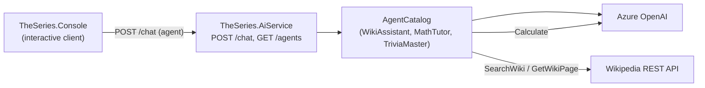

# TheSeries

A [.NET Aspire](https://learn.microsoft.com/dotnet/aspire/) sample built on **.NET 10**: a set of AI agents backed by Azure OpenAI, each with its own persona and toolset, that answer questions using Wikipedia and a calculator as tools.

## How it works



The Console sends a question (and the chosen agent) to the AI service's `POST /chat` endpoint. The service
hosts an `AgentCatalog` of stateless `ChatClientAgent`s (Azure OpenAI), each composed from an
`IAgentDefinition` that declares its instructions and tool subset. `GET /agents` lists the available
agents.

### Agents

| Agent | Persona | Tools |
|-------|---------|-------|
| **WikiAssistant** (default) | Concise research helper grounded in Wikipedia. | `SearchWiki`, `GetWikiPage` |
| **MathTutor** | Patient tutor that solves and explains arithmetic. | `Calculate` |
| **TriviaMaster** | Playful trivia host that researches facts and crunches numbers. | `SearchWiki`, `GetWikiPage`, `Calculate` |

## Projects

The solution ([TheSeries.slnx](TheSeries.slnx)) contains four projects, orchestrated by Aspire:

| Project | Role |
|---------|------|
| [src/TheSeries.AppHost](src/TheSeries.AppHost/AppHost.cs) | Aspire orchestrator. Wires up resources, injects Azure OpenAI config, sets service references. |
| [src/TheSeries.AiService](src/TheSeries.AiService/Program.cs) | ASP.NET Core minimal-API service exposing `POST /chat`. Hosts the agent. |
| [src/TheSeries.Console](src/TheSeries.Console/Program.cs) | Interactive console client that calls the AI service via service discovery. |
| [src/TheSeries.ServiceDefaults](src/TheSeries.ServiceDefaults/Extensions.cs) | Shared OpenTelemetry, health checks, resilience, and service discovery. |

## Prerequisites

- [.NET 10 SDK](https://dotnet.microsoft.com/download)
- An [Azure OpenAI](https://learn.microsoft.com/azure/ai-services/openai/) resource with a deployed chat model

## Configuration

Azure OpenAI settings are read from the **AppHost user-secrets** and injected into the AI service as
environment variables. Set them on the AppHost project:

```sh
dotnet user-secrets set "AzureOpenAI:Endpoint" "<url>" --project src/TheSeries.AppHost
dotnet user-secrets set "AzureOpenAI:Deployment" "<deployment>" --project src/TheSeries.AppHost
dotnet user-secrets set "AzureOpenAI:ApiKey" "<key>" --project src/TheSeries.AppHost
```

Missing configuration throws at agent creation. **Never commit secrets.**

## Build and run

Build the solution:

```sh
dotnet build TheSeries.slnx
```

Run everything (launches the Aspire dashboard):

```sh
dotnet run --project src/TheSeries.AppHost
```

### Running the Console

The Console is registered with `WithExplicitStart()`, so it does not launch automatically with the rest
of the app. To run it:

1. Start the app with `dotnet run --project src/TheSeries.AppHost` and open the Aspire dashboard.
2. Find the `console` resource and start it (▶). It needs an attached terminal for stdin, so use the
   dashboard's terminal/console view to interact with it.
3. The console lists the available agents and starts on the default. Type a question at the
   `<agent>>` prompt and press Enter. Use `/agents` to list them again and `/agent <name>` to switch
   (e.g. `/agent MathTutor`). Press Enter on an empty line to quit.

To run the Console **standalone** (against an already-running AI service), pass the service URL:

```sh
dotnet run --project src/TheSeries.Console -- --AiService:Url https://localhost:7123
```

Under Aspire it resolves the AI service by name (`https+http://aiservice`) via service discovery, so no
URL is needed.

## API

### `GET /agents`

Lists the available agents and the default name:

```json
{
  "agents": [
    { "name": "WikiAssistant", "description": "Concise research helper that answers factual questions using Wikipedia." },
    { "name": "MathTutor", "description": "Patient tutor that solves and explains arithmetic step by step." },
    { "name": "TriviaMaster", "description": "Playful trivia host that researches facts and crunches numbers." }
  ],
  "default": "WikiAssistant"
}
```

### `POST /chat`

Request (`agent` is optional; defaults to `WikiAssistant`):

```json
{ "message": "Who was Alan Turing?", "agent": "WikiAssistant" }
```

Response (echoes which agent answered):

```json
{ "reply": "Alan Turing was a British mathematician and computer scientist...", "agent": "WikiAssistant" }
```

Returns `400 Bad Request` when `message` is empty or `agent` is an unknown name.

## Conventions

- Target framework `net10.0`; `Nullable` and `ImplicitUsings` enabled across all projects.
- Top-level statements in `Program.cs` and minimal APIs (no controllers).
- DTOs are `internal sealed record` types declared at the bottom of the file that uses them.
- Agent capabilities are plain methods annotated with `[Description]` (on the method and each parameter)
  and exposed via `AIFunctionFactory.Create(...)` in each tool's `AsTools()`.
- Each agent is an `IAgentDefinition` under `src/TheSeries.AiService/Agents/`; add a new one by
  implementing the interface and registering it in `Program.cs`.
- Services reach each other by Aspire resource name (e.g. `https+http://aiservice`) through service
  discovery, not hardcoded URLs.

See [AGENTS.md](AGENTS.md) for contributor and AI-agent guidance.
