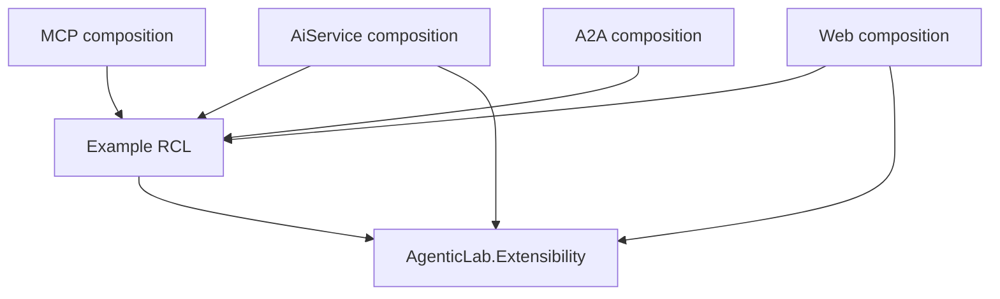

# Example modules

Examples are explicit, trusted .NET 10 Razor class libraries. Each owns its agents, host prompts,
tools, API, protocol adapters, data, process rules, UI, assets, documentation and tests. Executable
hosts provide model clients, discovery, run capture, service discovery and the existing Flow shell.
There is no runtime download, arbitrary assembly scanning, hot reload or security sandbox for modules.

See [Windfarm](../src/AgenticLab.Examples.Windfarm/README.md) for a full multi-host process example,
or [Copilot 365](../src/AgenticLab.Examples.Copilot365/README.md) for a smaller agent/tool example
without a custom panel.

## Dependency boundary



Production examples reference `AgenticLab.Extensibility`, never an executable host project.
Host references to an example belong only in project files and composition roots. Do not add a
domain-specific enum value, Flow collaborator, endpoint, tool, fixture or prompt to the core.
Tests may reference hosts to exercise their real protocol adapters.

The extension library contains the shared `IAgentDefinition`, `AgentDefinitionBase`, `IVendorHarness`
contracts; explicit module registration; narrow runtime/panel contracts; and the existing
`LabButton`, `LabField`, `LabStatus` and `MiniIcon` controls. It does not own example process state
or a generic approval/workflow engine.

## Add an example

1. Create `src/AgenticLab.Examples.<Name>` using `Microsoft.NET.Sdk.Razor`, targeting `net10.0` and
   referencing Extensibility. Keep example-specific files, README, `.http` requests and tests there.
   If the test project is nested under `Tests`, exclude `Tests/**` from the production project's
   `DefaultItemExcludes` so test code, dependencies, output and assets are not published with it.
2. Implement `IExampleModule` with a stable lowercase route-safe ID and an `ExampleManifest`.
   Declare owned host keys, agent names, MCP names, specialist names, resource labels and tool risks.
   Names must be unique; prefix protocol names to avoid collisions. Manifest metadata is presentation,
   not authorization: enforce the actual bounds inside tools and services.
3. Implement only the relevant role interfaces listed below. Keep the mutable process store in the
   backend role alone. Register `IAgentDefinition` and `IVendorHarness` implementations using the
   shared contracts; prompts alone cannot enforce approval or access control.
4. Reference the example project in the participating executable projects and register it explicitly:

   ```csharp
   builder.Services.AddExample<MyExample>(builder.Configuration, ExampleHost.AiService);
   ```

   Use `ExampleHost.Mcp`, `ExampleHost.A2A` or `ExampleHost.Web` in the other composition roots.
   The existing generic loading/mapping hooks do the rest. Add the project/test project to the solution.
5. Enable it through `--Examples:<id>:Enabled=true` when starting AppHost. AppHost forwards the
   `Examples` configuration section to all participating hosts. Omit the flag to contribute nothing.
   Referenced assemblies still build and their static assets may still be present; this is not unloading.
6. Add credential-free tests for domain invariants, disabled contributions, errors, concurrent cases,
   real loopback protocols and UI lifecycle. Link the example README from the catalogue here.

## Role contracts

| Interface | Owns | Host supplies |
| --- | --- | --- |
| `IAiServiceExample` | Backend registrations and `MapApi(RouteGroupBuilder)` | Prefix `/examples/{id}/api`, model/capture infrastructure |
| `IMcpExample` | Read clients and typed MCP SDK registrations | Existing stateless MCP HTTP server |
| `IA2AExample` | Persona-only `RemoteAgentDefinition` entries | Existing A2A host and its configured model |
| `IWebExample` | Locally compiled panel type and HTTP-client registrations | One optional conversation panel outlet |

Modules without custom panels set `RequiresUi=false` and do not implement `IWebExample`. Register
them with `ExampleHost.Web` as well as their backend role so Flow loads their manifest resources and
tool risks without registering backend services in Web. A module requiring UI is still supported
only when its local registration implements `IWebExample`. An empty `MapApi` is appropriate when the
existing host chat routes supply all required functionality.

Use normal SDK APIs, not a second tool-schema implementation. `AddExampleTools` takes a snapshot
before contributions mutate DI. Registration rejects duplicate module identities and conflicting
declared ownership; the existing agent dictionaries/A2A roster also reject duplicate identities.
Do not repeat domain names in core switch statements.

The host maps `GET /examples` to public manifests. Agent and vendor responses add optional
`exampleId` and `requiresExampleUi` fields, defaulting to null/false. Web only renders component
types registered locally; a remote catalogue cannot select an arbitrary assembly or component.
React excludes agents requiring an example UI it does not implement; its BFF allowlist is unchanged.

## Runtime capabilities

- `IAgentRunContext` exposes the host's current conversation and agent identity through a read-only
  interface. AiService opens an `AgentRunScope` in both chat paths and reactivates it after streaming
  yields. Bind mutable case tools to this identity, not model-supplied conversation IDs.
- `IMcpToolSource.GetTools(names)` returns only exact-name discovered tools. Existing TimeKeeper
  explicitly selects its original time tool. Registering an example must not widen another agent's tools.
- `IHostToolSource.GetTools(names)` returns explicitly published local tools in requested order and
   rejects unknown or incorrectly cased names. AiService's `DemoToolSource` publishes only `SearchWiki`,
   `GetWikiPage` and `Calculate`, preserving their implementations and schemas. Examples reuse these
   capabilities without referencing host projects or resolving arbitrary host services.
- `IAgentDelegation.InvokeAsync` returns a typed success/failure outcome and propagates cancellation.
  Examples enforce their own specialist allowlists, evidence envelopes and result validation.
  The existing `DelegateToAgent(agentName, question)` signature remains recognizable in flow replay.

Startup discovery must run before constructing the agent catalogue. Rediscovery rebuilds both
executable discovery-backed agents and their advertised tool metadata. Missing dependencies must
not be mistaken for successful tool evidence or review receipts.

MCP tools may call module API routes on AiService through service discovery. The reference is used
at invocation time only: listing tools must not contact AiService, because AiService performs discovery
before listening. MCP never `WaitFor(AiService)` while AiService waits for MCP. Example tool constructors
must not perform network calls. SDK activation may bypass typed-tool `HttpClient` construction; a named
`IHttpClientFactory` client resolved inside the tool method is a predictable adapter pattern.

## UI lifecycle

`ExamplePanelContext` contains conversation/host/agent identity, running state, a run version, a
draft-text command and an awaited new-conversation command returning the new ID. It does not expose
Flow state roots. An optional `IExamplePanel.BeforeResetAsync` releases/archives module state before
the host resets conversation history. Raw `/chat/reset` still resets chat memory only.

Keep controllers and scenario/case state inside the example and scoped to its component lifetime.
Cancel work on disposal; compare conversation/generation before publishing asynchronous results.
Do not let refresh responses invalidate an in-flight command. A failed mutation is not success;
reconcile authoritative state and use explicit idempotency for retryable side effects.

Host selection uses catalogue keys rather than extending the branding enum. The unchanged
`theseries-vendor` preference reads old enum-name strings and current keys, falling back safely when
the saved module is unavailable. Preserve existing state-root constructors, notifications and causal
replay behavior. Current case state is separate from replay; never invent tool events for UI actions.

Reuse the shared controls and host `--lab-*` tokens. Scope styles and static assets to the example,
using RCL `_content/<assembly>/...` paths. Domain panels remain compact, keyboard accessible and
responsive, leaving the conversation composer usable. See the [design system](design-system.md).

## Catalogue

| Example | Purpose | Documentation and tests |
| --- | --- | --- |
| Copilot 365 | Workplace chat, research and analysis over synthetic Microsoft 365 data; no custom panel | [Project README](../src/AgenticLab.Examples.Copilot365/README.md), [module tests](../src/AgenticLab.Examples.Copilot365/Tests) |
| Windfarm | Synthetic alarm investigation, remote specialist review and human-approved planned inspection | [Project README](../src/AgenticLab.Examples.Windfarm/README.md), [module tests](../src/AgenticLab.Examples.Windfarm/Tests) |