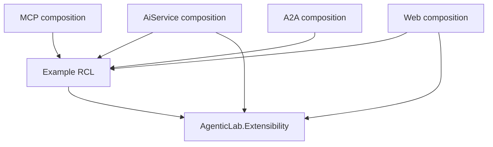

# Example modules

Examples are trusted, explicitly registered .NET 10 Razor class libraries. Each owns its domain
code, prompts, tools, adapters, UI, assets, docs and tests. Agentic Lab supplies model clients,
discovery, capture and the Flow shell. There is no runtime download, assembly scanning, hot reload
or module sandbox. See the [catalogue](#catalogue) for complete examples.

## Default startup

Base configuration enables only **Default**. AppHost Development additionally enables **ChatGPT**,
**GitHub Copilot** and **Copilot 365**. Other environments and standalone services need explicit
example configuration; `--Examples:<id>:Enabled=false` overrides a Development default.

Enable modules with `Examples:<id>:Enabled=true`. IDs are `chatgpt`, `gemini`, `copilot`,
`claude-code`, `claude`, `copilot365` and `windfarm`; flags can be combined. Copilot365's API host
key is `microsoft365`; the others use their module ID.

```sh
dotnet run --project src/AgenticLab.AppHost -- --Examples:chatgpt:Enabled=true --Examples:copilot:Enabled=true
```

Vendor prompts/labels are representative demos, not connections to those products. Model configuration
stays host-owned; shared learning content does not depend on enabled examples.

## Dependency boundary



Production examples reference `AgenticLab.Extensibility`, **never executable hosts**. Host references
to examples belong in project files and composition roots. Domain enums, Flow state, endpoints,
tools and fixtures stay out of core. Tests may reference hosts for real protocol checks.

Extensibility owns agent/module/runtime contracts and shared controls, not domain state or an
approval engine. Harness-only modules declare `AgentNames: []` because that list means ownership.
They reuse `SharedAgentNames` (`ChatAgent`, `Ask`, `Plan`, `Coder`), registered once in core.
ChatGPT owns `ChatGpt` and reuses published tools through `IHostToolSource`.

## Add an example

1. Create `src/AgenticLab.Examples.<Name>` using `Microsoft.NET.Sdk.Razor`, targeting `net10.0` and
   referencing Extensibility. Keep its guide, requests and tests inside the project. Exclude nested
   `Tests/**` through `DefaultItemExcludes` so test files/dependencies/assets are not published.
2. Implement `IExampleModule` and its manifest with a lowercase route-safe ID and unique owned host,
   agent and protocol names. Prefix protocol names. Metadata describes capabilities; tools/services
   must enforce them. Prompts alone cannot enforce approval or access control.
3. Implement the relevant roles below. Keep mutable process state in the backend role. Reference and
   register the module in each participating host, and add production/test projects to the solution.
4. Enable it with `--Examples:<id>:Enabled=true`; AppHost forwards `Examples` configuration.
   Disabled modules contribute nothing, but referenced assemblies/assets can still build and publish.
5. Add credential-free tests for domain bounds, disabled contributions, errors/concurrency, loopback
   protocols and UI lifecycle. Link the module guide in the catalogue.

Registration in the AiService composition root:

```csharp
builder.Services.AddExample<MyExample>(builder.Configuration, ExampleHost.AiService);
```

Use `ExampleHost.Mcp`, `ExampleHost.A2A` or `ExampleHost.Web` for other roles.

## Role contracts

| Interface | Owns | Host supplies |
| --- | --- | --- |
| `IAiServiceExample` | Backend registrations and `MapApi(RouteGroupBuilder)` | Prefix `/examples/{id}/api`, model/capture infrastructure |
| `IMcpExample` | Read clients and typed MCP SDK registrations | Existing stateless MCP HTTP server |
| `IA2AExample` | Persona-only `RemoteAgentDefinition` entries | Existing A2A host and its configured model |
| `IWebExample` | Locally compiled panel type and HTTP-client registrations | One optional conversation panel outlet |

Panel-less modules set `RequiresUi=false` and omit `IWebExample`, but still register for Web so
Flow gets resource/risk metadata without backend services. UI-required modules need a local panel.
An empty `MapApi` is fine when existing chat routes suffice.

Use normal SDK tool registration, not another schema layer. Registration rejects duplicate identities
and ownership conflicts; `AddExampleTools` snapshots registrations before contributions mutate DI.
`GET /examples` exposes public manifests. Agent/vendor responses include optional `exampleId` and
`requiresExampleUi` (null/false by default). Remote metadata cannot select arbitrary components.
React excludes unsupported UI-required agents and does not forward module APIs.

## Runtime capabilities

- `IAgentRunContext` supplies host-owned conversation/agent identity in both chat paths, including
   streaming resumes. Bind case tools to it, not model-supplied IDs.
- `IMcpToolSource.GetTools(names)` selects exact-name discovered tools. Never widen another agent's
   set; TimeKeeper selects only its time tool.
- `IHostToolSource.GetTools(names)` returns published tools in requested order and rejects unknown
   or incorrectly cased names. `DemoToolSource` publishes only `SearchWiki`, `GetWikiPage`, `Calculate`.
- `IAgentDelegation.InvokeAsync` returns a typed success/failure outcome and propagates cancellation.
   Examples enforce specialist allowlists and validate evidence/results. Missing dependencies are
   failures, not successful review receipts. Orchestrator's `DelegateToAgent` contract is unchanged.

Discovery precedes agent construction; rediscovery refreshes executable tools and advertised metadata.
MCP can call AiService through service discovery **at invocation time only**. Constructors and tool
listing must not contact AiService, which discovers protocols before listening; do not create circular
`WaitFor` dependencies. SDK tool activation may bypass typed-client construction, so use a named
`IHttpClientFactory` client inside the tool method when needed. See [protocols](protocols.md).

## UI lifecycle

`ExamplePanelContext` exposes identity, running state/version, draft updates and an awaited
new-conversation command, not Flow state roots. Optional `IExamplePanel.BeforeResetAsync` completes
module cleanup before chat reset. Raw `/chat/reset` clears chat memory only.

Keep controllers/case state inside the module. Cancel work on disposal and reject stale asynchronous
results by conversation/generation. Reconcile failed mutations and use idempotency for retryable side
effects. Keep current case state separate from causal replay; never invent tool events for UI actions.

`ExampleManifest.HostPresentation` maps owned host keys to `IconPath`, `DisplayOrder`,
`ProductConceptId` and `LegacyKeys`. Branding follows host key, not agent ownership. Use local
RCL `_content/<assembly>/host.svg` assets; registration rejects unowned keys, conflicting aliases
and attempts to own Default. Web uses a neutral icon when metadata is missing, never remote markup.

Host availability comes from `GET /vendors` plus local UI support. Default sorts first, then module
order and display name. `agenticlab-vendor` accepts case-insensitive canonical keys and enabled
aliases; unavailable selections fall back to Default, then the first available host.

Reuse shared controls and `--lab-*` tokens; scope CSS/assets to the module. Panels must remain compact,
keyboard-accessible and responsive without obstructing the composer. Product concept links point to
shared Learn content. See the [design system](design-system.md).

## Catalogue

| Example | Purpose | Documentation and tests |
| --- | --- | --- |
| ChatGPT | Dedicated conversational agent with bounded Wikipedia and calculator tools | [Project README](../src/AgenticLab.Examples.ChatGpt/README.md), [module tests](../src/AgenticLab.Examples.ChatGpt/Tests) |
| Gemini | Representative host prompt over the shared tool-free chat agent | [Project README](../src/AgenticLab.Examples.Gemini/README.md), [module tests](../src/AgenticLab.Examples.Gemini/Tests) |
| GitHub Copilot | Representative host prompt over shared Ask, Plan and Coder modes | [Project README](../src/AgenticLab.Examples.Copilot/README.md), [module tests](../src/AgenticLab.Examples.Copilot/Tests) |
| Claude Code | Representative host prompt over shared Plan and Coder modes | [Project README](../src/AgenticLab.Examples.ClaudeCode/README.md), [module tests](../src/AgenticLab.Examples.ClaudeCode/Tests) |
| Claude | Representative host prompt over the shared tool-free chat agent | [Project README](../src/AgenticLab.Examples.Claude/README.md), [module tests](../src/AgenticLab.Examples.Claude/Tests) |
| Copilot 365 | Workplace chat, research and analysis over synthetic Microsoft 365 data; no custom panel | [Project README](../src/AgenticLab.Examples.Copilot365/README.md), [module tests](../src/AgenticLab.Examples.Copilot365/Tests) |
| Windfarm | Synthetic alarm investigation, remote specialist review and human-approved planned inspection | [Project README](../src/AgenticLab.Examples.Windfarm/README.md), [module tests](../src/AgenticLab.Examples.Windfarm/Tests) |