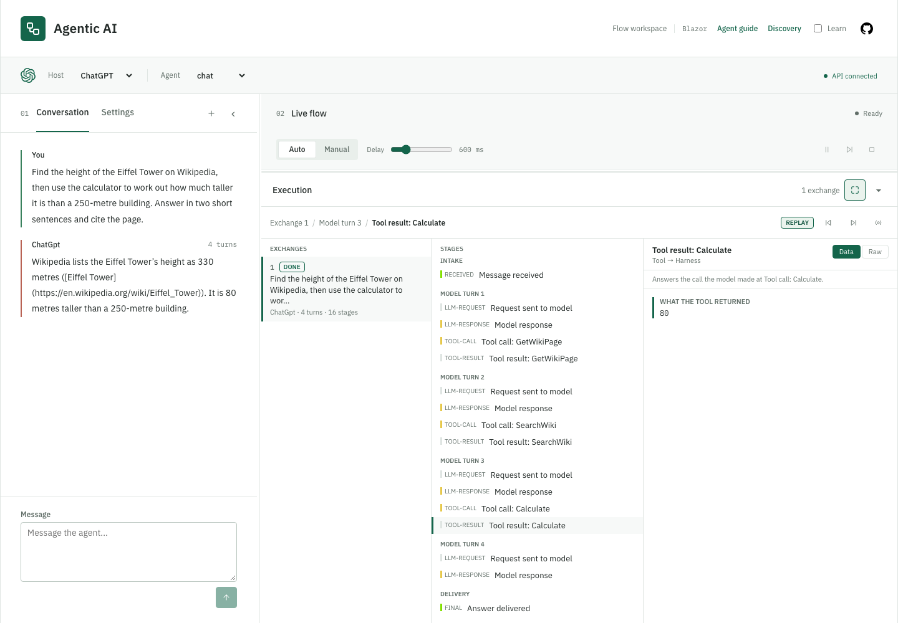
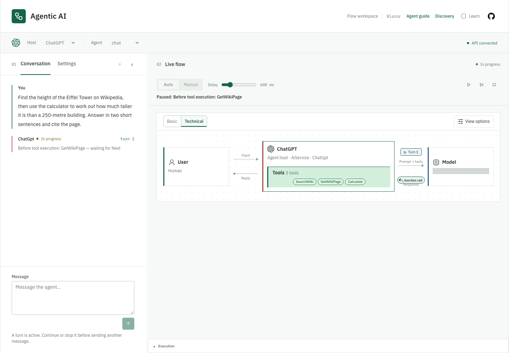

# Execution explorer and breakpoints

The [Flow page](web-flow-page.md) has two distinct controls: **replay** inspects captured history;
**breakpoints** pause real execution. Replay makes no model or tool calls. Captures can contain
sensitive data; see the [security policy](../SECURITY.md).

## Execution explorer (replay of a captured run)

[](images/03-execution-replay.png)

Open **Execution** beneath live flow, select an exchange, then a stage. Collapse, resize or maximize
the dock for larger payloads; its panes stack at narrow widths. See [Execution panel](#execution-panel)
for the three panes and replay behavior.

Images here were captured locally on 2026-09-22 using public Wikipedia data and real calculator
calls. They retain the former **Agentic AI** branding; the product is **Agentic Lab**. Gray masks
cover deployment identifiers. The ChatGPT-labelled host is an Azure OpenAI-backed demo, not the
ChatGPT product. Select an image for full size.

## Chat execution breakpoints

Enable any of these in **Settings**. They apply in Auto and Manual, start off, and stay selected
across conversations until page refresh.

| Breakpoint | Pauses |
| --- | --- |
| `before-model` | Before a model request. |
| `after-model` | After its complete response, including a response requesting tools. |
| `before-tool` | Before each actual function invocation. |
| `after-tool` | After a successful tool return. |

[](images/02-execution-breakpoint.png)

**Continue** resumes Auto until the next selected breakpoint. **Next** releases the boundary in
Manual. **Stop** cancels; it cannot undo completed side effects. Changing breakpoint selections affects
future boundaries without releasing a current pause. Model breakpoints are per round-trip, not token.
Tool breakpoints cover local/MCP calls and the local A2A delegation call, not remote agent internals.
Thrown tool errors follow normal error handling rather than `after-tool`.

The toolbar keeps Continue/Pause, Next and Stop in fixed positions. At a breakpoint, release actions
are disabled while a control request is pending; Stop stays available. Outside breakpoints, Next is
disabled in Auto and Pause is disabled in Manual.

[FlowSession](../src/AgenticLab.AiService/Application/Flow/FlowSession.cs) and
[FlowExecutionScope](../src/AgenticLab.AiService/Application/Flow/FlowExecutionScope.cs) gate real
model/tool execution. Release requests need the current pause ID; ordinary pacing cannot bypass it.
Discovery and non-streaming `/chat` do not use these breakpoints. Fake-model boundary tests run with:

```sh
dotnet test tests/AgenticLab.AiService.Tests/AgenticLab.AiService.Tests.csproj
```

## Replay retention

Web bounds **archived** exchanges per Flow page. Configure the starting budgets in
[Web settings](../src/AgenticLab.Web/appsettings.json):

```json
{
  "ReplayRetention": {
    "MaxArchivedExchanges": 20,
    "MaxArchivedPayloadBytes": 16777216
  }
}
```

On Send, [ReplayHistory](../src/AgenticLab.Web/Flow/ReplayHistory.cs) archives the previous exchange
and removes whole oldest exchanges until both limits hold. Zero exchanges disables archiving;
negative limits fail startup. An oversized exchange can be evicted entirely. The **current exchange
is exempt until the next Send**, even after completion, so one long run can exceed the archive budget.

Payload bytes estimate UTF-16 text, including captured data, structured arguments and metadata.
They exclude object overhead and derived allocations: this is not managed heap size or a tested
capacity limit. [Backend conversation retention](agents.md#conversation-retention) is independent.
New conversation clears captures; page disposal releases retained accounting.

| Meter | Aggregate instruments |
| --- | --- |
| `AgenticLab.Web.Replay` | `replay.archived.exchanges`, `replay.archived.events`, `replay.archived.payload_bytes`, cumulative `replay.evicted.exchanges` |
| `AgenticLab.Web.Flow` | `flow.active_pages`, `flow.retained_events`, `flow.retained_payload_bytes` |
| `AgenticLab.AiService.Flow` | `flow.active_sessions` |

These metrics carry no content or user/conversation/session IDs. Compare them with runtime heap,
allocations and latency, not browser memory alone. The separate [load-test guide](../tools/README.md)
covers idle/active/paused tabs, long runs, reset and disposal. Neither synthetic retention tests nor
that browser profile establish a concurrent-user capacity guarantee.

## `POST /chat/stream`

Accepts the [chat fields](agents.md#post-chat), client-supplied `conversationId` and `sessionId`,
`manual`, optional `stepDelayMs`, and optional `breakpoints`. The session ID correlates control calls.
An omitted/empty breakpoint array selects none; unknown names return `400 Bad Request`.

Returns `text/event-stream` with named `flow` events:

| Field | Meaning |
| --- | --- |
| `sequence`, `kind`, `label` | Event ordering, type and display label. |
| `detail`, `data` | Optional detail and full captured payload for the step. |
| `turn` | One-based model round-trip, with intake outside model turns. |
| `callId` | Pairs a tool result with its call, including repeated calls to one tool. |
| `toolCall` | Optional structured tool name/arguments; do not parse display text for routing. |

Kinds include `received`, `llm-request`, `llm-response`, `tool-call`, `tool-result`, `ask-question`,
`final`, `error` and `breakpoint`. Every completed model round-trip emits `llm-response`, including
responses that request tools. Auto delay and Manual stepping are server-gated, not client animation.

`breakpoint` notifications bypass normal event pacing so the client can release blocked execution.
Their `data` is JSON with `Id`, `Kind`, `Tool`, `Paused` and `Manual`. They are control notifications,
excluded from conversation content, replay stages, Context and Prompt signature totals.

## Execution panel

The dock has three panes:

- **Exchanges** lists retained messages, agents, outcomes and model-turn counts. Runs appear on Send,
  including stopped/failed runs and those that produced no events.
- **Stages** groups intake, model turns and delivery. Each turn reads causally: request, response,
  requested tool calls, then results. This differs from raw arrival order during streaming.
- **Inspector** shows captured content as readable **Data** blocks or verbatim **Raw** payloads.
  Missing data is marked **not captured**, never reconstructed.

Use **Previous / Next** or select a stage directly. The diagram follows that stage; a tool call
shows its arguments but not a later result. The live run continues recording while history is pinned.
**Live**, or sending the next message, returns to the current run. Replay never sends control requests.

Expanded-host **Context** and **Prompt signature** follow the same causal prefix and earlier retained
exchanges. Their current size totals agree; before the selected exchange's first request, size and
signature are unavailable. Comparison uses the preceding captured exchange; Delta includes only
earlier exchanges and the selected prefix. Inference, Embeddings and Neural network stay live.

Eviction shows a notice and preserves original exchange numbers. Transcript, Context and signature
history cover retained exchanges only, although a captured request can contain older history re-sent
by AiService. New conversation clears captures. The pure
[ExecutionReplayBuilder](../src/AgenticLab.Web/Flow/ExecutionReplayBuilder.cs) owns causal grouping;
[ExecutionStageReader](../src/AgenticLab.Web/Flow/ExecutionStageReader.cs) reads captured payloads.

## `POST /chat/control`

Drives an in-progress `/chat/stream` run, keyed by its `sessionId`:

```json
{ "sessionId": "abc123", "action": "next", "manual": true, "delayMs": 600 }
```

`action` is one of `next` (advance one step in Manual mode), `pause`, `resume`, `stop`, or
`answer` (submit the `answer` field to a waiting [user question](agents.md#asking-the-user-a-question-human-in-the-loop)). `manual` and
`delayMs` are optional live adjustments. Returns `204 No Content`, or `404 Not Found` when the session is
unknown (e.g. already finished).

Send `breakpoints` to replace the enabled selection live (`[]` clears it; omission leaves it unchanged).
To release a breakpoint, include its current notification's `Id` as `breakpointId`:

```json
{ "sessionId": "abc123", "action": "resume", "breakpointId": "pause-occurrence-id" }
```

When releasing a breakpoint, `resume` selects Auto and `next` selects Manual.
A stale or already-released ID returns `409 Conflict`.
Ordinary pacing controls cannot bypass the breakpoint latch. Discovery and non-streaming `/chat`
do not use execution breakpoints.
