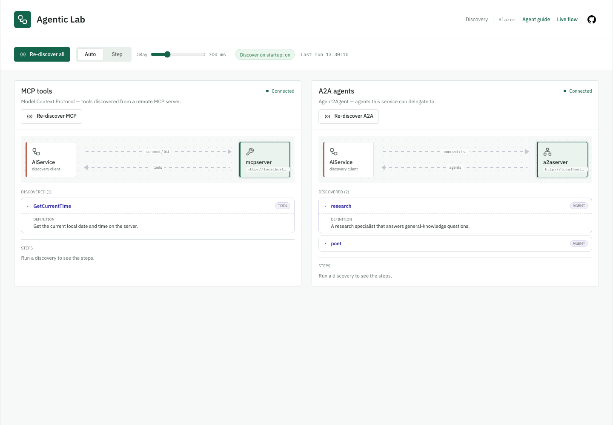

# MCP, A2A and discovery

Agentic Lab uses **MCP** to call remote tools and **A2A** to delegate to remote agents. These are real
protocol integrations; neither protocol grants trust or authorization. Use trusted services within
the sample's [security boundary](../SECURITY.md).

## MCP server (the TimeKeeper agent)

[McpServer](../src/AgenticLab.McpServer/Program.cs) exposes `GetCurrentTime` over HTTP, plus tools
from enabled examples. AppHost runs it as `mcpserver`; it needs no model credentials.
[McpToolProvider](../src/AgenticLab.AiService/Application/Discovery/McpToolProvider.cs) resolves
`services:mcpserver:http:0`, lists and caches tools, and returns an empty list on discovery failure.
`TimeKeeper` selects only `GetCurrentTime`, even when other tools are discovered.

AiService's `GET /mcp` returns `Servers: [{ Name, Tools: [{ Name, Description }] }]`.
The MCP server URL can also be configured in VS Code's MCP configuration for direct use.

The v2 MCP SDK uses **stateless HTTP** by default. The time tool needs neither a transport session
nor unsolicited server-to-client requests. This is separate from chat conversation memory and SSE.
Registration uses `AddMcpServer().WithHttpTransport().WithTools<TimeTools>()` and `MapMcp()`.

## A2A server (the Orchestrator agent)

[A2AServer](../src/AgenticLab.A2AServer/Program.cs) hosts persona-only agents declared under
`A2A:Agents`, with `{ Name, Path?, Description, Instructions }`. Defaults are `research` and `poet`;
paths default to `/a2a/{name}`. Microsoft Agent Framework registers each with `AddAIAgent`,
`AddA2AServer` and `MapA2AJsonRpc`. AppHost supplies Azure OpenAI settings to this `a2aserver` resource.

The server's `GET /agents` returns `{ Agents: [{ Name, Path, Description }] }`.
[A2AAgentProvider](../src/AgenticLab.AiService/Application/Discovery/A2AAgentProvider.cs) resolves
`services:a2aserver:http:0` (or standalone `A2A:Endpoint`), discovers that roster, and creates named
clients. Its `DelegateToAgent(agentName, question)` tool returns the remote reply; unknown names
return the valid roster. Discovery failure leaves an empty tool list.

`Orchestrator` has `Calculate` plus delegation: arithmetic can stay local while specialist questions
go to another agent. AiService's `GET /a2a` returns `{ Agents: [{ Name, Description }] }`.
"Sub-agent" describes the caller/callee relationship, not another A2A protocol type.

## Optional Example Contributions

[Example modules](examples.md) register their own MCP tools and A2A persona descriptors explicitly.
Registration and metadata listing must not contact AiService: it discovers protocols before listening.
MCP adapters may call it at invocation time, but must not create circular startup waits.

Discovery precedes catalogue construction; rediscovery refreshes executable agents and advertised
tool lists. Examples enforce their own remote allowlists and receive typed delegation outcomes.
Orchestrator keeps its text-returning contract. Flow shows a selected example's capabilities;
Discovery shows the full server roster.

## Protocol integration tests

[ProtocolIntegrationTests.cs](../tests/AgenticLab.AiService.Tests/ProtocolIntegrationTests.cs)
uses ephemeral loopback Kestrel servers, real `TimeTools` and a fake-model A2A agent. It exercises the
production providers, rediscovery and invocation after reconnecting without Azure credentials.
Neighboring `FlowExecutionTests` checks streamed tool execution, disabled-tool enforcement and
second-turn history. Use the [upgrade check](#dependency-upgrade-checks) below to run both.

## Discovery visualization (MCP + A2A)

[](images/05-protocol-discovery.png)

Captured locally on 2026-09-22. Select the image for full size.

Open **Discovery** from Flow for a modal, or visit `/discovery` directly. Each source shows its
connection state, discovered definitions and step log. Choose **Re-discover all** or a source's own
command, then use Auto/Step, Delay, Next, Pause/Resume and Stop. Startup discovery is a read-only
status here, configured by `Discovery:OnStartup` (default `true`) in
[AiService settings](../src/AgenticLab.AiService/appsettings.json).

The modal initially reads only the last snapshot. It preserves Flow's conversation, draft, settings
and replay; an active chat continues. Rediscovery is disabled during that parent chat because it
reconnects shared clients. This is a local UI guard, not cross-client locking. Close, Escape or a
backdrop click cancels only Discovery's request/stream and restores focus. After rediscovery, Flow
refreshes live catalogues without changing historical rosters or conversation identity.

### Discovery API

| Endpoint | Contract |
| --- | --- |
| `GET /discovery` | Snapshot: `{ DiscoverOnStartup, Sources: [DiscoverySourceStatus] }`. Each source includes endpoint, state, last-run time and items. |
| `POST /discovery/stream` | `{ SessionId, Source?, Manual, StepDelayMs }`; streams `DiscoveryEvent` records over SSE. Source is `mcp`, `a2a`, or `all`/null for both. |
| `POST /chat/control` | Uses Discovery's session ID for `next`, `pause`, `resume`, `stop` and live pacing changes. See the [control API](execution-explorer.md#post-chatcontrol). |

Rediscovery has side effects: it clears old clients/tools, reconnects, lists items and refreshes
discovery-enabled agents. Events progress through `Start`, `Cleanup`, `Endpoint`/`NoEndpoint`,
`Connecting`, `Listing`, `Item`, then `Done`/`Error`.
[DiscoveryTracer](../src/AgenticLab.AiService/Application/Discovery/DiscoveryTracer.cs) serializes
discovery runs and uses server-side pacing. Disabling startup discovery leaves these manual commands
available; agents work after discovery without a restart.

## Remote A2A agents

Select Default's **orchestrator** mode and enable **A2A agents** in View options. Each discovered
agent appears as **Agent host + Model** below the main flow. Research and Poet share one separate
A2A service process; their model nodes indicate roles, not separate known deployments.

Arrows distinguish **Delegation requested** from **Result returned**. A request is not confirmation
of a network send, and a returned result can contain an error. Remote model calls, prompts, tools,
settings and token counts are not captured; internal links stay static. Expand the agent host to
open read-only remote-agent Details without delegating or changing the selected chat agent.

[A2AFlowBuilder](../src/AgenticLab.Web/Flow/A2AFlowBuilder.cs) uses structured `FlowEvent.ToolCall`
arguments and call IDs, never the display-formatted call text. Replay uses the exchange's saved roster
and causal prefix: no future replies or later agents appear early. Unknown targets or old captures
without structured metadata fall back to a generic resource. Replay and held/stopped runs do not animate.

## Dependency upgrade checks

Run the deterministic agent and protocol integration tests without Azure credentials:

```sh
dotnet test tests/AgenticLab.AiService.Tests/AgenticLab.AiService.Tests.csproj --filter "FullyQualifiedName~FlowExecutionTests|FullyQualifiedName~ProtocolIntegrationTests"
```

These deterministic checks do not verify live Azure OpenAI, production entry points or Aspire startup;
those require a separate full-app smoke test.
