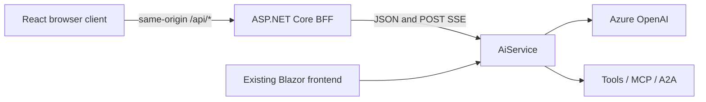

# React frontend example

Agentic Lab's **optional** React/TypeScript frontend runs alongside Blazor, using the same agent APIs.
It renders in the browser with Vite and `createRoot`, without SSR, Blazor or SignalR.
**Normal .NET restore/build does not run npm.** Node is needed only to develop or build this example.

## Architecture



Vite forwards `/api` to the BFF through server-only `BFF_URL`. The BFF uses service discovery
(`https+http://aiservice`) or standalone `AiService:Url`. After build, it serves static React assets
and the same API routes without a Node runtime.

The BFF uses YARP direct forwarding and an explicit path/method allowlist:

| Browser route | Unchanged AiService route |
|---|---|
| `GET /api/agents` | `GET /agents` |
| `GET /api/vendors` | `GET /vendors` |
| `POST /api/chat/stream` | `POST /chat/stream` |
| `POST /api/chat/control` | `POST /chat/control` |
| `POST /api/chat/reset` | `POST /chat/reset` |

Payloads/status codes pass through unchanged. Unknown paths return 404, wrong methods 405, and POST
bodies require JSON. There is no catch-all proxy or browser-selected destination; API errors never
fall through to frontend HTML. Development exposes `/openapi/v1.json` and an
[HTTP request file](../src/AgenticLab.Bff/AgenticLab.Bff.http). No CORS changes, Azure keys or private
service URLs are needed in the browser bundle.

The catalogue filters out workspace agents and agents with `requiresExampleUi=true`. Missing optional
example metadata remains compatible. Enabling a module does not bypass these filters; Copilot and
Claude Code have no supported modes here. Module APIs and approval panels are not implemented.
See [example startup](examples.md#default-startup) for enablement and Development defaults.

## Run with Aspire

Install Node **24 LTS** and complete the [.NET 10 / Aspire 13.5.4 and Azure setup](../README.md#run-locally).
From the repository root:

```sh
npm --prefix src/AgenticLab.React ci
dotnet run --project src/AgenticLab.AppHost -- --ReactFrontend:Enabled=true
```

Alternatively, after installing dependencies:

```sh
aspire run -- --ReactFrontend:Enabled=true
```

Open **react** in the Aspire dashboard; **react-bff** serves its API and **web** still opens Blazor.
Vite uses Aspire's assigned `PORT` and BFF endpoint. `ReactFrontend__Enabled=true` is the equivalent
environment setting; omit it to leave React off. `AddViteApp` runs only when enabled. Aspire publishing
attaches built assets to BFF `wwwroot` with `PublishWithContainerFiles`, not a Vite runtime server.

## Standalone development

With AiService running, substitute its actual HTTP URL below. BFF defaults to port 5181:

```sh
AiService__Url=http://localhost:5039 dotnet run --project src/AgenticLab.Bff
```

In another terminal:

```sh
npm --prefix src/AgenticLab.React ci
BFF_URL=http://localhost:5181 npm --prefix src/AgenticLab.React run dev
```

Vite defaults to `http://127.0.0.1:5173`; use `-- --port <free-port>` if occupied. These variables
are server-side. An unavailable API shows a retryable error, never silent sample data.

## Build and host without Vite

Build React **before** publishing BFF; its project includes existing `dist` assets without running npm.
Replace the example AiService URL with your own:

```sh
npm --prefix src/AgenticLab.React ci
npm --prefix src/AgenticLab.React run build
dotnet publish src/AgenticLab.Bff -c Release -o artifacts/react-bff
AiService__Url=http://localhost:5039 dotnet artifacts/react-bff/AgenticLab.Bff.dll \
  --contentRoot "$PWD/artifacts/react-bff" --urls http://localhost:5182
```

Open `http://localhost:5182`. Rebuild assets before publishing frontend changes; missing assets leave
an API-only BFF. This example adds no registry image or changes to existing image-publishing targets.

## Prototype scope

The conversation/live-flow split supports:

- Chat, follow-ups, New conversation and an answer input for agent questions.
- Auto/Manual, Next, Pause/Resume, Stop and live mode changes.
- SSE-driven User, Agent host, Model and Tools activity, pairing calls/results by call ID.
- Loading, empty, failed, interrupted and stopped states; keyboard/IME input and reduced motion.

Learn, Details/anatomy, replay, discovery, workspace tools and model simulations stay in Blazor.
The model label uses declared deployment metadata; [ForceDefaultModel](agents.md#per-agent-models)
can make the execution deployment differ. Responses render Markdown without raw HTML. Events are
execution records, not token deltas or hidden reasoning; only `final` delivers the answer.
The header's repository link opens [Agentic Lab on GitHub](https://github.com/o-viken/agenticlab)
in a new tab.

## Transport and state

[Contracts](../src/AgenticLab.React/src/api/contracts.ts) validate wire shapes with Zod;
[stream parsing](../src/AgenticLab.React/src/api/stream.ts) uses `eventsource-parser` and incremental
UTF-8 decoding for POST SSE, including split chunks, CRLF and multiline data. Native `EventSource`
cannot POST. Payload data stays opaque unless needed; unknown event kinds remain readable rows.

Chat POSTs **never retry/reconnect automatically**. Each send snapshots agent/vendor and creates a
session UUID. Conversation IDs last until successful reset, without persistence or sharing between
tabs. Selectors lock during runs/reset; generation guards reject late events and unmount cancels work.

Changing Host resets before committing the new host/default agent, clearing transcript/activity but
preserving draft and mode. Agent-only changes and initial loading do not reset. Failed reset preserves
the current host, agent and conversation and allows retry. Switching back to an earlier host starts fresh.

Manual Next works before the first event or headers arrive. Only definite initial control 404s retry
at 100/200/400/800ms; successful or ambiguous controls are never replayed. One control can be pending;
early events still release it correctly. Next/Resume honor received breakpoint IDs without an editor.

SSE forwarding disables idle timeout, buffering and minimum response data rate, without a retrying
HttpClient pipeline. Ordinary APIs retain finite timeouts. Cancellation propagates upstream; EOF
without a terminal event means **Interrupted**. Stop cancels locally and sends best-effort backend
stop; a racing 404 is harmless.

Browser retention is 200 lightweight trace rows, 100 tool-call identities and 20 transcript exchanges,
not a prompt archive. [Backend history](agents.md#conversation-retention) has its own lifetime.

## Customize the appearance

| Area | Files | Change when |
|---|---|---|
| Theme | [tokens.css](../src/AgenticLab.React/src/styles/tokens.css) | Colours, typography and contributor accents |
| Presentation | [App.tsx](../src/AgenticLab.React/src/App.tsx), [components](../src/AgenticLab.React/src/components) and CSS modules | Layout and controls |
| Behavior/transport | [flow](../src/AgenticLab.React/src/flow), [api](../src/AgenticLab.React/src/api) | Execution or wire contracts |

Keep presentation on the existing `RunState`/`FlowRun` actions. Do not fetch inside visual nodes,
parse tools from display text or couple themes to agent names. Preserve contributor meanings.

Local IBM Plex fonts (SIL OFL), Lucide icons (ISC) and the Octicons mark (MIT) retain their
[licenses](../src/AgenticLab.React/public/licenses). React Compiler is off; correctness must not
depend on memoization. This is a forkable example, not a plugin system or published UI SDK.

## Verification

From the repository root:

```sh
dotnet test tests/AgenticLab.Bff.Tests/AgenticLab.Bff.Tests.csproj
npm --prefix src/AgenticLab.React ci
npm --prefix src/AgenticLab.React run lint
npm --prefix src/AgenticLab.React run typecheck
npm --prefix src/AgenticLab.React test
npm --prefix src/AgenticLab.React run build
cd src/AgenticLab.React
npx playwright install chromium
npm run test:e2e
```

Build BFF first (`dotnet test` does this). Playwright runs a loopback fixture, real BFF and Vite on
ports 5197, 5183 and 5174; the app never silently uses the fixture. Tests need no Azure credentials.
.NET checks forwarding/SSE boundaries; Vitest checks parsing and lifecycle races. React CI is separate
from the .NET-only solution check and image publishing.

## Security and release boundary

There is no caller authentication; UUIDs identify state, not permission. Before public hosting add
identity, per-user authorization, CSRF protection, quotas, isolation and deployment limits. Keep keys
on AiService, avoid logging captured payloads and configure BFF `AllowedHosts` deliberately.
See [SECURITY.md](../SECURITY.md) for the full boundary.