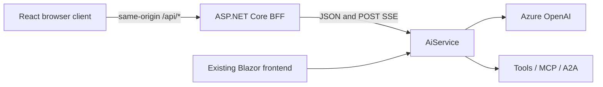

# React frontend example

The React Flow Workspace is an optional alternative frontend, not a replacement for Blazor. It shows
how a contributor can design a different interface over the existing agent APIs. It uses React,
TypeScript and Vite with `createRoot`: rendering and interaction run in the browser, with no React SSR,
Blazor or SignalR dependency. The existing Blazor application and its feature set are unchanged.

## Architecture



During development Vite forwards `/api` to the BFF using a server-only `BFF_URL`. The BFF reaches
`https+http://aiservice` through Aspire service discovery, or `AiService:Url` when run standalone.
For a built application the BFF serves the static React output and the same `/api` routes. Serving
static JavaScript is not server-side rendering. Node is a build/development prerequisite, not a
runtime dependency of the built BFF.

The BFF uses YARP direct forwarding and an explicit path/method allowlist:

| Browser route | Unchanged AiService route |
|---|---|
| `GET /api/agents` | `GET /agents` |
| `GET /api/vendors` | `GET /vendors` |
| `POST /api/chat/stream` | `POST /chat/stream` |
| `POST /api/chat/control` | `POST /chat/control` |
| `POST /api/chat/reset` | `POST /chat/reset` |

Payloads and status codes pass through unchanged. There is no catch-all proxy, browser-supplied
destination, or duplicate agent implementation. Unknown API paths return 404, wrong methods return
405 and POST bodies require JSON. API failures cannot fall through to the frontend document.
The development BFF provides `/openapi/v1.json` route metadata and
[an HTTP request file](../src/AgenticLab.Bff/AgenticLab.Bff.http) for manual exploration.
No AiService endpoint or CORS change is needed; no Azure key or private service URL is in the bundle.

## Run with Aspire

The normal .NET-only workflow remains unchanged. React is disabled unless explicitly requested.
Install Node **24 LTS** only when working on this example, plus the repository's .NET 10 / Aspire
13.5.4 prerequisites and existing AppHost Azure OpenAI configuration.

```sh
npm --prefix src/AgenticLab.React ci
dotnet run --project src/AgenticLab.AppHost -- --ReactFrontend:Enabled=true
```

Alternatively, after installing the frontend dependencies, use the Aspire CLI from the repository root:

```sh
aspire run -- --ReactFrontend:Enabled=true
```

The CLI restores and builds the AppHost and its dependencies before starting the application.

Open the **react** resource URL in the dashboard. **react-bff** provides the API boundary; the existing
**web** resource still opens Blazor. Vite uses Aspire's assigned `PORT` and BFF endpoint. The flag can
also be supplied as `ReactFrontend__Enabled=true`. Omit it for the original startup.

`AddViteApp` owns dependency installation and Vite execution only when the option is enabled.
Ordinary .NET restore/build and existing container targets never run npm. Aspire publishing attaches
the frontend output to BFF `wwwroot` via `PublishWithContainerFiles`, not a Vite runtime server.

## Standalone development

With AiService running, set its URL on the BFF in one terminal. Substitute its actual HTTP endpoint
for the example below; the BFF default port is 5181.

```sh
AiService__Url=http://localhost:5039 dotnet run --project src/AgenticLab.Bff
```

In another terminal:

```sh
npm --prefix src/AgenticLab.React ci
BFF_URL=http://localhost:5181 npm --prefix src/AgenticLab.React run dev
```

Vite defaults to `http://127.0.0.1:5173`. Use `-- --port <free-port>` if occupied. These environment
variables are server-side. An unavailable API produces a retryable error, never silent sample data.

## Build and host without Vite

Build React **before** publishing the BFF. Its project links an existing `dist` into publish output
without an npm MSBuild target:

```sh
npm --prefix src/AgenticLab.React ci
npm --prefix src/AgenticLab.React run build
dotnet publish src/AgenticLab.Bff -c Release -o artifacts/react-bff
AiService__Url=http://localhost:5039 dotnet artifacts/react-bff/AgenticLab.Bff.dll \
  --contentRoot "$PWD/artifacts/react-bff" --urls http://localhost:5182
```

Open `http://localhost:5182`. Missing assets leave an API-only BFF, not an automatic Node installation.
Build assets again before publishing frontend changes. This prototype adds no registry image and
does not modify the existing four image-publishing targets.

## Prototype scope

The first screen is a conversation-led split view with a compact live flow and current-run activity.
Host/agent choices come from the API; workspace-dependent agents are excluded in this first slice.
The model node shows real deployment metadata, not a simulated vendor model.
The header's GitHub icon opens [the project repository](https://github.com/o-viken/agenticlab) in a
new tab without replacing the workspace. The locally bundled mark comes from
[GitHub Octicons](https://github.com/primer/octicons), with its MIT license in `public/licenses`.

- Chat, follow-up messages and explicit New conversation.
- Auto/Manual, Next, Pause, Resume, Stop and switching modes during a run.
- User, Agent host, Model and Tools activity driven by real SSE events.
- Tool requests/results paired by call ID, distinguishing requested from returned.
- A conditional answer input when an agent asks a question.
- Loading, empty catalog, control failure, interruption, stopped run and API error states.
- Keyboard controls, IME-safe Enter/Shift+Enter, reduced motion and responsive layouts.

Learn, anatomy/Details, replay, discovery, workspace tools and simulated model internals stay in
Blazor. Responses render Markdown without raw HTML. The stream carries execution events, not token
deltas or hidden reasoning. The answer appears once on `final`; an `llm-response` requesting a tool
is not another final answer.

## Transport and state

`api/contracts.ts` validates wire shapes with Zod. `api/stream.ts` uses `eventsource-parser` and
incremental UTF-8 decoding for POST SSE: split chunks, CRLF and multiline data are supported. Native
`EventSource` cannot issue the required POST. Captured `data` stays opaque unless its event kind
needs it. Unknown future event kinds remain readable activity rows.

Chat POSTs never retry/reconnect automatically. Each send creates a session UUID; the browser instance
keeps its conversation UUID until a successful reset. IDs are not persisted or shared between tabs.
Agent/vendor values are snapshotted per send; selectors lock during a run. Generation guards reject
late events/acknowledgements. StrictMode does not submit from an effect; unmount cancels the request.

Manual mode waits before the **first** event, so Next works before headers/data arrive. Only a definite
initial control 404 gets bounded 100/200/400/800ms retries. Successful or ambiguously failed controls
are not replayed. Only one control is pending; events arriving before acknowledgement still release
the pending step correctly. Unexpected breakpoint IDs are honored by Next/Resume without an editor.

The SSE forwarder disables idle activity timeout, response buffering and the minimum response data
rate. It does not use the retrying HttpClient pipeline; normal API calls retain finite timeouts.
Downstream cancellation propagates upstream. EOF without a terminal event is Interrupted, not
Completed. Stop cancels locally and sends best-effort backend stop; a racing 404 is not a run failure.

The browser keeps 200 lightweight trace rows and 100 tool-call identities, not prompt payload archives.
The transcript retains the latest 20 exchanges; backend conversation memory uses the existing server
retention policy. A reset failure preserves the current transcript.

## Customize the appearance

| Area | Files | Change when |
|---|---|---|
| Theme | `src/styles/tokens.css` | Changing colors, typography and contributor accents |
| Presentation | `src/App.tsx`, `src/components/`, their CSS modules | Changing layout, visuals and control arrangement |
| Behavior/transport | `src/flow/`, `src/api/` | Extending execution behavior or the API contract |

Change `--accent`, surfaces or local font imports without touching API code. Preserve contributor
meanings when teaching the existing concepts. For another layout, replace `App` or `LiveFlow`, passing
the same `RunState` and `FlowRun` actions. Do not fetch inside visual nodes, parse tool names from
display text, or couple a theme to backend agent names.

IBM Plex Sans/Mono fonts (SIL OFL) and Lucide icons (ISC) are bundled locally. Their original licenses
ship in `public/licenses`; dependency versions use the committed lockfile. React Compiler is not
enabled and correctness does not depend on manual memoization. There is no plugin system or published
UI SDK yet: this is a small, forkable example.

## Verification

From the repository root:

```sh
dotnet test tests/AgenticLab.Bff.Tests/AgenticLab.Bff.Tests.csproj
npm --prefix src/AgenticLab.React ci
npm --prefix src/AgenticLab.React run lint
npm --prefix src/AgenticLab.React run typecheck
npm --prefix src/AgenticLab.React test
npm --prefix src/AgenticLab.React run build
cd src/AgenticLab.React
npx playwright install chromium
npm run test:e2e
```

Build the BFF first (`dotnet test` also builds it). Playwright starts a loopback fixture, actual BFF
and Vite on test ports 5197, 5183 and 5174. The fixture is never imported or silently used by the app.
.NET boundary tests use actual AiService `FlowSession` and `FlowEvent` with ASP.NET Core SSE, without
Azure. Vitest covers parser boundaries, lifecycle races, identity, reset failures and unmount cleanup.
The dedicated React CI job runs independently of existing image publishing. Full solution tests remain
a .NET-only compatibility check.

## Security and release boundary

This is a local example, not production authentication. UUIDs identify runs/conversations but do not
authorize access. Before public hosting add identity, per-user session/conversation authorization,
appropriate CSRF protection, quotas, workspace isolation and deployment limits. Keep Azure keys on
AiService, and do not log captured prompts/tool payloads by default. Configure `AllowedHosts`
deliberately for a deployed BFF rather than exposing arbitrary access to a local agent service.