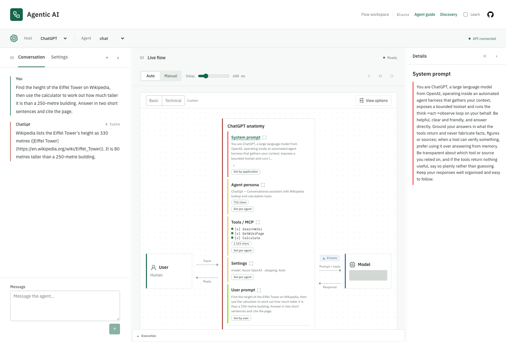

# Web flow page (live agent run visualization)

Agentic Lab's Blazor workspace shows a conversation beside its live agent execution. Open the
**web** resource from the Aspire dashboard after [local setup](../README.md#run-locally).
Captures show requests, responses and tool activity, not the model's private reasoning.
Live runs can send data to external services and incur model charges; use trusted inputs and
read the [security policy](../SECURITY.md).

## Live flow visualization

### Conversation and Settings

Choose **Host** and **Agent** above the workspace, then send a message from **Conversation**.
The host selects a representative prompt and available modes; the backend remains Azure OpenAI.
Default is always available. Other hosts require enabled [example modules](examples.md#default-startup).
Unavailable saved hosts fall back to Default. Selectors are locked during a run.

Changing Host starts a new conversation, clears the transcript and captures, and selects that host's
default agent. The draft, workspace and view preferences survive. Changing only Agent, reselecting
the current host or restoring it at startup does not reset chat. If server cleanup fails, Blazor
reports it but keeps the new local conversation ID.

**Settings** contains tool toggles, breakpoints, workspace paths, skills and custom instructions.
Skills default on; instructions are opt-in. Workspace features appear for agents that support them;
see the [workspace guide](workspace.md). Switching tabs preserves the chat log and draft.
**New conversation** is in the panel header and is disabled during a run. A waiting
[agent question](agents.md#asking-the-user-a-question-human-in-the-loop) gets its own answer input
near the composer. Replies are displayed as escaped text.

### Run controls

The toolbar above live flow owns **Auto / Manual**, delay, Pause/Resume, Next and Stop. Auto advances
with a server-side delay; Manual waits for Next. This controls backend execution, not just animation.
At a breakpoint, Continue resumes Auto and Next releases the boundary in Manual. Unavailable actions
stay visible but disabled; the holding reason and control errors appear below the toolbar.

**Execution** beneath the diagram inspects captured stages without rerunning them. See
[Execution and breakpoints](execution-explorer.md) for control semantics, replay and retention.

### View options

The diagram separates **Agent host** from **Model**: the host manages execution; the model chooses
an answer or a tool request. **Agent** encloses both, while User is outside. Separate arrows show
requests and responses, and the loop counter counts model round-trips. Technical labels add
implementation details; branded model labels marked **simulated** are not vendor integrations.
See [model configuration](agents.md#per-agent-models) for declared versus execution deployments.

**Basic / Technical** apply complete display presets. **Custom** means the current options match
neither preset; it is not a third preset. **View options** exposes every option under all presets,
stays open while changing them, and closes on Escape or an outside click.

| Display option | Basic (initial) | Technical |
|---|---|---|
| Model and its arrows | Off | On |
| Loop counter | Off | On |
| Technical labels | Off | On |
| Tools | Off | On |
| Skills, MCP servers, A2A agents | Off | Off |
| Environment & risk, Agent / Agent host boundaries | Off | Off |
| Expand agent host, Prompt signature, Inference, Embeddings, Neural network | Off | Off |

Display changes never enable tools, filter captures, reset history or move the replay cursor.
Options last for the page lifetime. Reapplying a preset resets its options but preserves panel
interactions such as a pinned token. Hiding Model disables the loop-counter control without losing
its preference; teaching panels can stay visible independently.

**Tools** shows tool details and the active resource below the main row. **Skills**, **MCP servers**
and **A2A agents** independently show supported catalogues; the latter also shows
[remote agent flows](protocols.md#remote-a2a-agents). Skills appear before a run and highlight when
loaded through `ReadSkill`. Tool activity grows downward without recentering the main nodes.

### Inspect the agent host

Enable **Expand agent host** to see the anatomy: application guidance, agent persona, configured
tools/settings and user context. Contributor colours distinguish application (red), agent (yellow)
and user (green), independently of branding. Click a section heading to open its read-only **Details**.
Compact hosts show plain labels; collapsing the anatomy leaves an open Details selection intact.

[](images/04-host-inspector.png)

Captured locally on 2026-09-22; this image retains the former **Agentic AI** branding. The product
is **Agentic Lab**. Gray masks cover deployment identifiers. The ChatGPT-labelled host is an Azure
OpenAI-backed demo, not the ChatGPT product. Select the image for full size.

Details shows the selected section, not the whole request:

- **System prompt** is host guidance; **Agent persona** uses captured text or the agent description.
- **Settings** shows provider/deployment, not execution controls. **Tools** uses captured definitions
  when available, otherwise configured names. Skills/instructions show catalogue text and enablement.
- **User prompt** is the submitted message, never the draft. **Context** is captured conversation content.
- An **A2A agent** shows its description, protocol, delegation status and captured request/result.
  Remote system prompts, model settings and tools are unavailable through discovery.

Captured configuration must match the exchange's agent, host and workspace. Replay uses only data
available through the selected stage; missing or malformed captures are marked unavailable.
User prompt and Context retain their exchange provenance after configuration changes. Late catalogue
responses cannot replace newer selections. Details holds no separate capture archive.

Details and Learn have independent widths, scrolling and collapse controls and can stay open together.
Changing host, agent or workspace keeps the selected host section while updating its contents.
Selecting another section replaces it; closing Details clears its selection. A2A inspection requires
the expanded anatomy and does not select or invoke the remote agent. Inspection changes no draft,
execution option or replay cursor and triggers no extra file reads, model calls or discovery runs.
Close/Escape restores focus to the invoking heading, or View options if the anatomy was collapsed.

### Context and Prompt signature

**Context** previews user messages, tool results and replies, with retained earlier exchanges shown
separately. Its character estimate agrees with **Prompt signature**, which groups System, User,
Assistant and Tool result content. The calculation includes captured replies but excludes the static
tool catalogue and JSON structure; persona and tool-definition sizes have separate anatomy badges.

Prompt signature has two views:

- **Comparison** compares the last captured request of adjacent conversation exchanges, not adjacent
  model round-trips. **Match** measures their identical prefix, not actual provider cache usage.
- **Delta** shows reused versus added character counts per exchange. This size-based growth split
  is separate from the prefix-match score.

Context and Prompt signature follow the replay cursor. Before an exchange's first captured request,
its size/signature is unavailable; later results do not appear early. **Live** restores the current
run. See [replay behavior and retention](execution-explorer.md#execution-panel).

### Model simulations

These optional panels are teaching aids, **not captured model internals**:

- **Inference** illustrates tokenization and answer generation, with an approximate character-based
  token count and fabricated candidate probabilities.
- **Embeddings** shows deterministic fake vectors and a two-dimensional map, not semantic embeddings
  returned by Azure OpenAI.
- **Neural network** illustrates a forward pass and token choice, not the model's weights or architecture.

Click a prompt token, vector row or map point to pin it across panels; click again to unpin.
The network uses the same fabricated input. These interactions make no backend calls. Unlike Context
and Prompt signature, these panels stay on the live run during replay. Reduced motion suppresses
visual effects without changing execution pacing.

### Discovery and Learn

**Discovery** opens a modal without replacing the conversation, draft or execution history. Opening
it reads the last snapshot; re-discovery is explicit and disabled while the parent chat runs.
Closing cancels only Discovery's stream and restores focus. See the [protocol guide](protocols.md).

**Learn** opens the contextual topic dock; **Agent guide** opens the standalone lessons in a new tab.
They are independent of Details. See the [learning guide](learning.md).

### Layout and preferences

Conversation/Settings sits beside live flow, with Execution below and Details/Learn alongside.
Narrow layouts stack these regions without changing selections or run state. Drag splitters to
resize, or use arrow keys, Shift+arrows, Home and End. Conversation starts with adaptive sizing;
dragging saves a pixel width. **Reset layout** restores adaptive sizing without clearing the draft,
run, replay cursor or Details/Learn selections. Details sizing and Execution maximization are transient.

Browser preferences use `agenticlab-vendor`, `agenticlab-panels`, `agenticlab-workspace-bases` and
`agenticlab-workspace-recent`. Previous product-name keys are not migrated or deleted. Existing
six-field panel values are accepted; new values include the adaptive-width flag. Enabled host aliases
can restore older host selections, but cannot make a disabled module available.

### Environment and risk

**Environment & risk** adds location badges, a trust boundary and the agent's reported risk/guardrails
from `GET /agents`. These are descriptions, not enforcement. Coder reports High, read-only agents
Low, and ChatAgent None. Copilot365's Medium example uses simulated mail, not real delivery.
Prompted confirmation is not a host-enforced approval gate; workspace checks and the terminal
allowlist are [not a sandbox](workspace.md#workspace-scoped-tools-the-coder-agent).

## Example Panels

[Example modules](examples.md) may add a panel above the conversation. UI-required modes appear only
with a locally registered panel; panel-less modules can still provide branding and resource/risk
metadata. Domain state stays in the module and separate from captured replay. Web awaits module
cleanup before New conversation; raw `POST /chat/reset` clears chat history only.

## Corporate workbench

The [V8 mockup](../design/mockups/v8-corporate-workbench.html) is historical. Current presentation
follows the [Blazor design system](design-system.md); this heading preserves existing bookmarks.

## Running the web UI

With Azure OpenAI configured, start the app and open the automatically started **web** resource:

```sh
dotnet run --project src/AgenticLab.AppHost
```

For backend-free lessons, run only Web and visit `/learn`; see [learning](learning.md).
Use the [browser smoke guide](../tools/README.md) for no-model-call layout and accessibility checks.

## Implementation reference

[Flow.razor](../src/AgenticLab.Web/Components/Pages/Flow.razor) composes the page.
[FlowViewState](../src/AgenticLab.Web/Flow/FlowViewState.cs) owns selections/preferences;
[FlowRunController](../src/AgenticLab.Web/Flow/FlowRunController.cs) owns the run and captured data.
Their feature collaborators and pure builders live under [Flow](../src/AgenticLab.Web/Flow).
Shared presentation follows the [design system](design-system.md), not either state root.

[FlowTracer](../src/AgenticLab.AiService/Application/Flow/FlowTracer.cs) produces the
[SSE contract](execution-explorer.md#post-chatstream), consumed by
[AiServiceClient](../src/AgenticLab.Web/Services/AiServiceClient.cs).
Keep long pauses viable: chat streaming removes the shared resilience handlers, and AiService
disables Kestrel's minimum response data rate for the stream. Captured payloads can contain sensitive
content even though endpoint credentials are not deliberately rendered.
