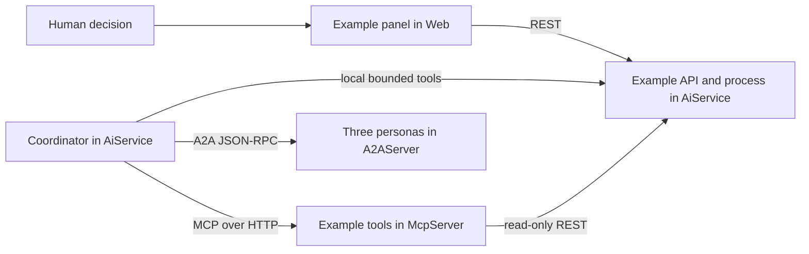

# Windfarm Operations

A self-contained Agentic Lab example: investigate a synthetic turbine alarm, compare inspection
windows, obtain three independent specialist reviews and prepare a proposal for a human decision.
All domain code, registrations, prompts, fixtures, UI, assets, tests and this guide live in this project.
It references the shared extension library, not an executable host.

**This is a training sandbox.** Fjordvik Wind Farm, WT-07, crews, parts, telemetry, forecasts and
procedure limits are fictional. The example does not connect to SCADA, control equipment, trade
power, dispatch crews or authorize physical work. Its constraints are illustrative, not certified
engineering guidance or any company's operating procedure.

## Run

Use the repository's .NET 10/Aspire prerequisites and AppHost model provider settings:

```sh
dotnet run --project src/AgenticLab.AppHost -- --Examples:windfarm:Enabled=true
```

Open **web** from the Aspire dashboard, select **Windfarm Operations / Coordinator**, choose a
scenario and select **Start case**. The starter question is filled but not sent automatically.
Use Technical view to inspect the real tool calls and remote specialist boundaries.

Interactive coordinator/specialist requests use the configured model provider and may
incur model charges. Deterministic tests do not need model credentials. Normal startup leaves the
module disabled; it contributes no endpoints, agents, protocol tools or panel until enabled.
No extra process or operational credentials are needed.

## The process

1. `WindfarmGetCase` supplies the current case and scenario, bound by the host to the conversation.
2. Five read-only MCP tools fetch telemetry, history, weather, crew/parts and procedure records
   through the actual operational API. Each record includes a source ID and a synthetic marker.
3. `WindfarmEvaluateOptions` computes eligible and blocked choices. Checks include telemetry age
   and sample count, wind limit, duration, crew qualification/availability and parts delivery.
   Estimated lost MWh is expected MW multiplied by the three-hour inspection, not a physical model.
4. `WindfarmDraftPlan` selects a known option with all its source references and a bounded rationale.
   Every revision invalidates previous specialist reviews.
5. `DelegateToAgent` sends a host-built draft/evidence packet to the three allowlisted A2A specialists.
   Valid responses produce revision-bound receipts; malformed/unavailable/conflicting responses do not.
6. `WindfarmSubmitProposal` requires all three ready reviews and deterministic eligibility. It freezes
   the proposal as **Awaiting human approval**. There is still no work order.
7. A person reviews the exact proposal in the panel and selects **Approve plan** or **Reject plan**.
   Approval atomically records one simulated planned-inspection order and case-local reservations.

The model chooses evidence gathering, questions, recommendations and delegation. Code enforces
tool authority, case identity, valid transitions, feasibility, review binding and approval. Specialist
agreement is advisory, not a safety certification. A normal chat reply such as "yes" cannot create an
order: there is no approval, raw-HTTP, shell or equipment-control tool in the coordinator's tool set.

| Agent | Review responsibility |
| --- | --- |
| `WindfarmCoordinator` | Investigates, compares choices and composes the reviewed proposal |
| `windfarm-reliability` | Alarm evidence, history and diagnostic uncertainty |
| `windfarm-planning` | Weather, crew, parts, window duration and estimated production loss |
| `windfarm-risk` | Evidence completeness, unresolved concerns and the human decision boundary |

Remote specialists are persona-only agents with no tools. They cannot claim to have independently
queried equipment. Flow captures delegation requests/results, not remote internal reasoning,
system prompts or token counts. Human decisions appear in case history, not fabricated model events.

## Repeatable scenarios

| Scenario | Expected behavior |
| --- | --- |
| Gearbox inspection (`inspection`) | Both qualified-crew windows are eligible; compare estimated loss and choose a justified inspection |
| Storm and delayed parts (`replanning`) | The early window fails wind and parts checks; the later qualified-crew window remains eligible |
| Stale telemetry (`missing-evidence`) | Case opens on **Evidence hold**; no draft, submission or approval can bypass missing telemetry |

All fixture calculations use **20 September 2026, 08:00 UTC** as scenario time, not the current date.
The alarm is a temperature/vibration trend, not a confirmed gearbox failure. The proposed action
is an inspection and oil sample, not replacement, shutdown or restart.

Try the starter question, then reject a proposal with a note requesting the later window. Ask the
coordinator to revise it; it must obtain fresh reviews. Approve only after the refreshed proposal is
shown. In the stale-evidence scenario, ask it to continue anyway and verify that the process refuses.
Model wording/tool order can vary; process invariants do not depend on those choices.

## Module roles



[WindfarmExample.cs](WindfarmExample.cs) is the role-aware registration entry. AiService alone
owns the mutable process store. MCP owns read-only HTTP adapters; A2A owns the specialist personas;
Web owns the panel and its client. Module registration/listing makes no network call. This permits
startup discovery before the operational API begins listening, without circular Aspire wait rules.

The coordinator selects only `WindfarmTelemetry`, `WindfarmMaintenanceHistory`, `WindfarmWeather`,
`WindfarmResources` and `WindfarmProcedure` from MCP discovery. The original TimeKeeper remains
time-only. The example's selected A2A display contains only its three specialists.

## State and approval

The state machine is `Investigating -> Draft -> AwaitingApproval -> WorkOrderCreated | Rejected`.
Missing evidence produces `Blocked`; reset produces `Archived`. Rejected plans can be revised;
pending proposals cannot. Decisions bind conversation ID, case ID, revision and proposal hash.
Identical idempotency-key retries return the original receipt; changed payloads or stale/concurrent
decisions fail with a conflict. Old case URLs cannot mutate a replacement case.

**Reset case** and Web **New conversation** archive the old case before rotating conversation
identity. A plain `POST /chat/reset` only clears model history; archive process state explicitly when
using raw APIs. Each case has independent mutable resources, so demo sessions cannot consume each
other's inventory. State is in memory and lost on restart; case history is bounded to 128 entries,
drafts to 32 revisions. Defaults can be configured through:

```json
"Examples": {
  "windfarm": {
    "Enabled": true,
    "MaxCases": 100,
    "InactiveTtl": "01:00:00",
    "CleanupInterval": "00:05:00"
  }
}
```

Expired cases are not silently recreated. At active capacity, creation fails instead of evicting
another case. Missing dependencies, invalid source references and stale decisions fail closed.
Cancellation stops the in-flight tool/model work; it cannot undo a previously explicit human decision.

This local sample has **no user authentication or RBAC**. Conversation binding prevents accidental
mixing, not hostile multi-user access. Anyone with network access to the operator API is trusted as
an operator. Production use requires authentication, authorization, durable storage, audit controls
and actual validated operating procedures. Do not expose these development endpoints publicly.

## API

The API is mapped under `/examples/windfarm/api` on AiService, without core domain endpoints.
[Windfarm.http](Windfarm.http) covers scenario reads, create/read/options/draft/submit/decide/archive
and failure paths. Development OpenAPI is at
`/examples/windfarm/api/openapi/windfarm.json`. It documents only this module's routes.

Specialist receipts have no public submission endpoint: only the host-side A2A adapter records a
validated response for the draft it actually sent. Clients cannot fabricate reviews to unlock approval.
Decision routes are operator commands and never advertised in MCP or model tool schemas.

For standalone hosts, set `Examples__windfarm__Enabled=true` on each participating process and use
`AiService__Url` for the MCP/Web module clients. Normal Aspire startup supplies service discovery.
There is no separate example process and no extra model configuration.

## Verify

From the repository root:

```sh
dotnet test src/AgenticLab.Examples.Windfarm/Tests/AgenticLab.Examples.Windfarm.Tests.csproj
```

Tests cover process rules, approval/retry/concurrency, isolation, retention, stale routes/responses,
panel rendering and real loopback HTTP/MCP/A2A calls with deterministic fake models. They also prove
MCP can list tools while the operational API is offline, then invoke them after it starts.

Install temporary Playwright per [browser setup](../../tools/README.md), then run the module-owned
no-model browser checks against an enabled Development instance:

```sh
AGENTICLAB_URL=<web-url> NODE_PATH=/tmp/agentic-lab-loadtest/node_modules \
  node src/AgenticLab.Examples.Windfarm/Tests/windfarm-smoke.mjs
```

The script checks 390, 1024, 1440 and 1920px layouts, locally served assets, case start/reset, risk
labels and missing-evidence holds. It creates/archives isolated synthetic cases but sends no chat
and does not run discovery. Screenshots are written to the system temporary directory.
Live Azure behavior and Aspire startup are separate checks, not proven by fake-model tests.

## Asset

The small illustrative wind-turbine photograph is served locally from
[wwwroot/images/windfarm.jpg](wwwroot/images/windfarm.jpg), sourced from
[Unsplash](https://images.unsplash.com/photo-1466611653911-95081537e5b7)
under the [Unsplash license](https://unsplash.com/license). It does not depict a real Fjordvik site.
No external image request is made by the running panel.

For another self-contained example, follow the [module contributor guide](../../docs/examples.md).